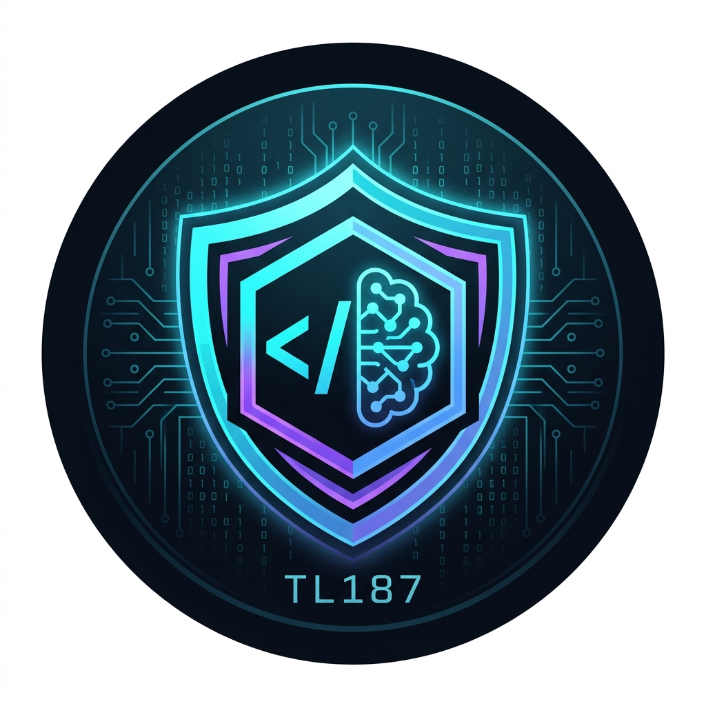
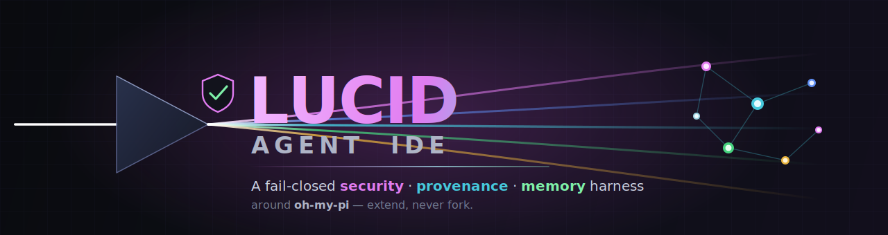
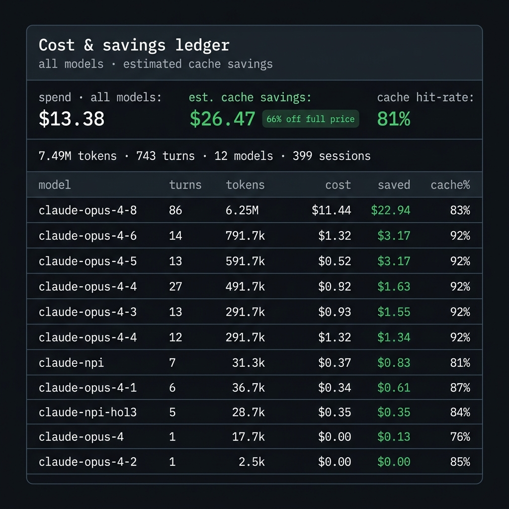
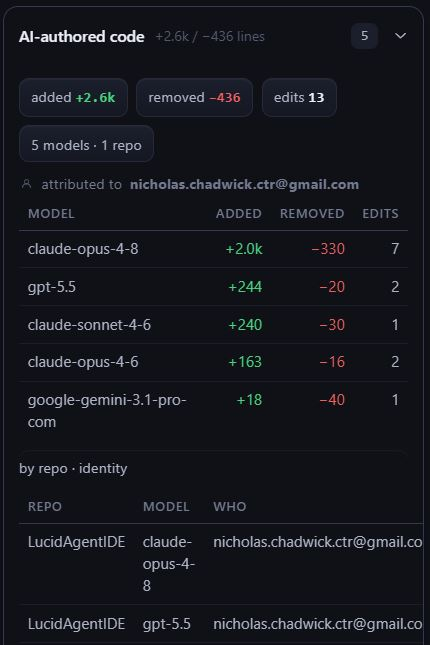
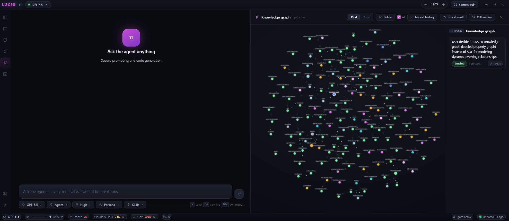
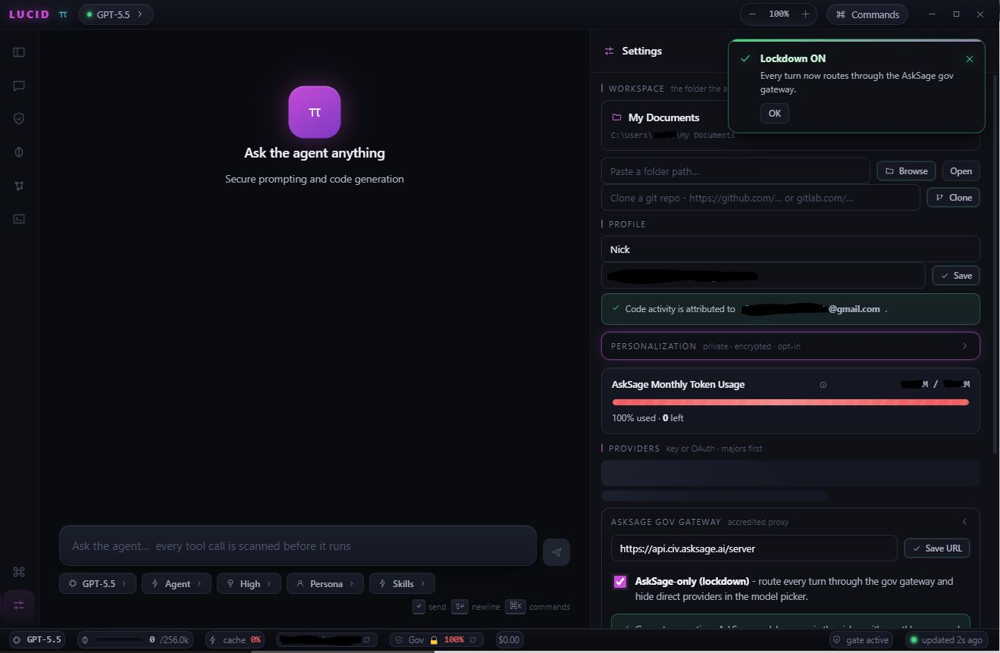
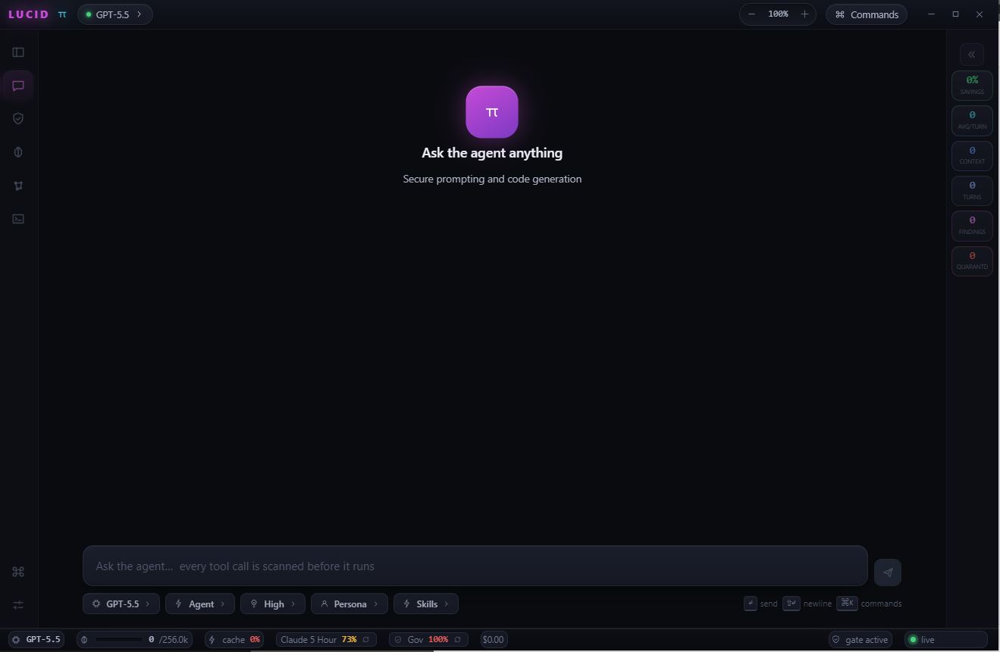
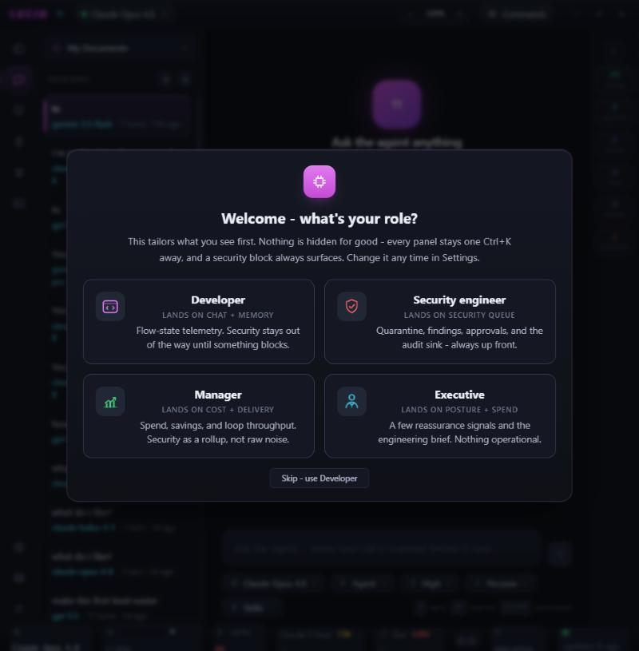
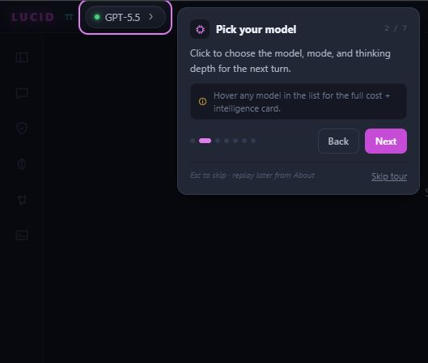

<!--
  SEO / discovery metadata. GitHub renders this block invisibly; search engines, raw-file
  crawlers, and AI agents that read README.md pick it up. Repo TOPICS (set in repo settings)
  are the strongest GitHub-search signal - mirror these keywords there too.

  LucidAgentIDE - a fail-closed security, provenance, and memory layer around oh-my-pi (omp).
  Topics: ai-agent-security, prompt-injection-defense, llm-security, agent-observability,
  provenance, duckdb, kv-cache, prompt-caching, asksage, government-ai, cui, fips,
  personalization-knowledge-graph, ai-code-attribution, cost-showback, chatgpt-import,
  monaco, electron, bun, typescript, oh-my-pi, omp, agentic-coding, secure-ai-coding-assistant.
-->
<meta name="description" content="LucidAgentIDE - a fail-closed security, provenance, and memory layer around oh-my-pi (omp): prompt-injection defense, trust labeling, provenance-backed memory, sovereignty-aware model governance, AI-authorship attribution, one-command ChatGPT/Claude/Gemini migration, cross-model cost showback, and a read-write IDE where even Save is scanned." />
<meta name="keywords" content="AI agent security, prompt injection defense, fail-closed gate, Unicode scanner, LLM provenance, agent observability, DuckDB telemetry, KV-cache prompt optimization, prompt caching, AskSage government AI gateway, CUI, FIPS, personalization knowledge graph, AI code attribution, AI-authored lines of code, cross-model cost showback, ChatGPT import, Claude, Gemini, Monaco editor, Electron, Bun, TypeScript, oh-my-pi, omp, agentic coding, secure AI coding assistant, agent IDE" />
<meta name="robots" content="index, follow, max-image-preview:large" />
<meta name="googlebot" content="index, follow" />
<meta name="author" content="Nick Chadwick (TechLead187)" />

<div align="center">



<br/>



<br/>

<a href="https://github.com/mlcyclops/lucidagentide/actions/workflows/ci.yml"></a>
<a href="https://github.com/mlcyclops/lucidagentide/actions/workflows/codeql.yml"></a>
<a href="https://github.com/mlcyclops/lucidagentide/actions/workflows/build-desktop.yml"></a>
<a href="https://github.com/mlcyclops/lucidagentide/actions/workflows/build-desktop.yml"></a>
<a href="https://github.com/mlcyclops/lucidagentide/actions/workflows/build-desktop.yml"></a>


<br/>

<a href="https://github.com/mlcyclops/lucidagentide/releases/latest/download/LucidAgentIDE-Setup.exe"></a>
<a href="https://github.com/mlcyclops/lucidagentide/releases/latest/download/LucidAgentIDE-mac-arm64.zip"></a>
<a href="https://github.com/mlcyclops/lucidagentide/releases/latest/download/LucidAgentIDE-mac-x64.zip"></a>
<a href="https://github.com/mlcyclops/lucidagentide/releases/latest/download/LucidAgentIDE-x86_64.AppImage"></a>
<a href="https://github.com/mlcyclops/lucidagentide/releases/latest"></a>

<sub>⬆ Always the most recent successful release - links auto-update each version (no release yet? they appear after the first tagged build).</sub>

<br/>


<br/>

**A security · provenance · memory layer built _around_ <a href="https://omp.sh">oh-my-pi</a> - not a fork.**
A fail-closed prompt-injection gate, provenance-backed memory, **sovereignty-aware model governance**,
**AI-authorship attribution**, **one-command migration from ChatGPT**, and a **read-write IDE where even
_Save_ is scanned** - wrapped in a polished desktop app, added entirely through omp's hooks, custom tools,
and SDK.

<sub>🔒 <b>What it does is open; how the hard parts work is not.</b> The deepest trust, provenance, and
personalization internals are proprietary and intentionally undocumented here - this README describes the
<i>capabilities and guarantees</i>, not the mechanisms behind them.</sub>

<a href="#-who-its-for"><b>Who it's for</b></a> ·
<a href="#-quick-start"><b>Quick start</b></a> ·
<a href="#-security-model"><b>Security</b></a> ·
<a href="#-token-cost-savings--showback"><b>Cost Savings</b></a> ·
<a href="#-knowledge--rag-coming-soon"><b>Knowledge / RAG</b></a> ·
<a href="#-contributing"><b>Contributing</b></a> ·
<a href="#-roadmap"><b>Roadmap</b></a> ·
<a href="DECISIONS.md"><b>Decisions (ADRs)</b></a>

</div>

---

## Table of contents

- [ Overview](#-overview)
- [ What makes it novel](#-what-makes-it-novel)
- [🎯 Who it's for](#-who-its-for)
- [💰 Token Cost Savings & Showback](#-token-cost-savings--showback)
- [ Architecture](#-architecture)
- [ Security model](#-security-model)
- [ Memory and the personalization graph](#-memory-and-the-personalization-graph)
- [ Models and the AskSage gateway](#-models-and-the-asksage-gateway)
- [📚 Knowledge & RAG (Coming Soon)](#-knowledge--rag-coming-soon)
- [ Built on](#-built-on)
- [ Quick start](#-quick-start)
- [ Desktop app](#-desktop-app)
- [ Onboarding](#-onboarding)
- [🤝 Contributing](#-contributing)
- [ Roadmap](#-roadmap)
- [ Project docs](#-project-docs)

---

##  Overview

**LucidAgentIDE** wraps [oh-my-pi (omp)](https://omp.sh) - a fast agentic coding runtime that provides
tool-calling, model routing, sessions, sandboxing, and a TUI - with the security/provenance/memory layer
from the project's v3 PRD. The wrapper rides omp's hundreds of releases instead of forking it: everything
is added through **hooks, custom tools, and the SDK**.

The whole system enforces one lifecycle, end to end:

> untrusted text enters → **scanned** → **trust-labeled** → **sanitized** → **persisted with provenance**
> → **blocked at the tool / memory-promotion / dispatch boundaries** → **human-reviewed** → and exits only
> as **safe, audited evidence** - with provenance-tracked recursive runs, replay, and a KV-cache-optimized
> prompt prefix proven by benchmark.

The architecture in one line: **TypeScript on Bun, in-process with omp.** The *only* Python is the pure
Unicode `scanner-sidecar/`, behind a narrow NDJSON contract, so the fail-closed gate that consumes it can
never fail open.

<div align="center">

|  Security |  Provenance |  Memory |
|:--|:--|:--|
| Unicode scanner + fail-closed quarantine gate, in-process on every tool call | Stable IDs, trust labels, and a DuckDB audit trail for every run, finding & approval | Promotion-gated semantic memory **+ a shipped, encrypted, cross-session personalization graph** |

</div>

##  What makes it novel

Twelve things you rarely find together. Each is in plain language below - the deeper "how" stays proprietary.

| What's novel | What it means for you |
|:--|:--|
| 🛡️ **Security *around* a moving target** | The injection defense lives in omp's extensions, so it upgrades with omp - no fork, no merge debt. |
| 🔒 **A gate that cannot fail open** | If the scanner dies or returns garbage, the gate **blocks** (never "safe"). A test kills it mid-run and the block still holds. |
| 🧬 **Provenance-gated memory** | Suspicious or quarantined content can **never auto-save** into memory. Trust comes from the source, not the caller's word. |
| 🧊 **A cache-stable prompt** | The safety layers are byte-identical on every request. Untrusted text only ever enters **delimited** and **after** the cache point - faster *and* safer. |
| 🏛️ **A gov-grade gateway, gated** | [AskSage](https://asksage.ai) is wired in with a lockdown mode, **scanned** personas, and answers grounded on your own datasets, with citations. |
| 🧠 **An encrypted personalization graph** | A private, encrypted "second brain" the agent learns from you and **recalls across sessions** - CUI-isolated and exportable. *(Shipped.)* |
| 🪪 **AI-authorship attribution** | A tamper-evident ledger of **which model wrote which lines** - per repo, per person, per session. |
| 🌐 **Sovereignty-aware governance** | Gov-only lockdown, curated model lists, and a clear **warning wall** before any foreign-origin model is used. |
| ⬇️ **One-command migration** | Bring your **ChatGPT / Claude / Gemini** history in - every message scanned, then distilled into your private graph. |
| ✍️ **An IDE where _Save_ is scanned** | Edit and save through the **same** gate. A hidden-Unicode payload is blocked **before a byte lands on disk**. |
| 🔁 **Loop engineering, not just a loop** | `/goal` runs an agent to a **verified** finish - with a budget kill switch, stall guards, and an after-action report. |
| 💰 **Cost tracking & showback** | Live per-model spend and cache savings - know exactly what every conversation costs. |

<sub>Loop engineering is inspired by the [loop-engineering](https://github.com/cobusgreyling/loop-engineering) playbook. Every action above still passes the same fail-closed gate.</sub>

---

## 🎯 Who it's for

| If you are… | Why it matters here |
|:--|:--|
| **Government / regulated / CUI teams** | An AskSage-gated, **sovereignty-aware** agent with hard **CUI isolation**, a fail-closed gate, and a full provenance/audit trail - packaged for **locked-down, air-gapped laptops** with *zero prerequisites* (Bun + the Python sidecar are bundled). |
| **Security-conscious engineers** | Every tool call, **every _Save_**, every persona, and every imported message is scanned by a gate that **cannot fail open**. Prompt-injection defense is the default, not a toggle. |
| **Teams that need governance & showback** | Real **cost per model** with cache-savings showback, plus a tamper-evident ledger of **which model wrote which lines** - so AI spend and AI authorship are both auditable. |
| **Anyone leaving ChatGPT / Claude / Gemini** | **One-command import** brings your history in (gated + distilled into an encrypted personal graph) and keeps your context **across sessions**. |
| **Agent-platform builders** | A worked, test-backed example of adding security, provenance, and memory **around** a fast runtime via hooks/tools/SDK - **extend, never fork**. |

It's a **desktop app you can just download and run** (Windows installer/portable + macOS), and a **source-available codebase** you can study, run from source, and build on.

## 💰 Token Cost Savings & Showback

<div align="center">

<table><tr><td>

> **Real-time cost visibility across every model and session.**
>
> LucidAgentIDE's **Cost & Savings Ledger** (P10.2 · [ADR-0011](DECISIONS.md)) tracks token usage,
> estimated cache savings, and per-model cost breakdowns - giving you full showback visibility over
> your AI spend. No surprises, no black-box billing.

<br/>

| Metric | Value |
|:--|--:|
| **Total Spend (all models)** | **$35.73** |
| **Est. Cache Savings** | **$73.66** *(67% off full price)* |
| **Cache Hit-Rate** | **82%** |
| **Tokens Processed** | **21.34M** across 1,998 turns |
| **Models Used** | **29** across 1,041 sessions |

<br/>

**Per-model breakdown** *(top models · 24 more in the ledger):*

| Model | Turns | Tokens | Cost | Saved | Cache % |
|:--|--:|--:|--:|--:|--:|
| claude-opus-4-8 | 242 | 18.26M | $32.51 | $67.89 | **84%** |
| claude-opus-4-6 | 14 | 791.7k | $1.32 | $3.17 | **92%** |
| gpt-5.5 | 21 | 659.8k | $1.15 | $2.24 | 76% |
| claude-sonnet-4-5 | 4 | 114.6k | $0.31 | $0.18 | 64% |
| claude-sonnet-4-6 | 4 | 141.9k | $0.30 | $0.18 | 48% |

</td></tr></table>

<table>
<tr>
<td align="center" valign="top">

<br/>
<sub><b>↑ Cost &amp; Savings Ledger</b> - spend, cache savings, and cost per model, live</sub>
</td>
<td align="center" valign="top">

<br/>
<sub><b>↑ AI-authored Code Ledger</b> - which model wrote which lines, by repo &amp; identity</sub>
</td>
</tr>
</table>

</div>

<br/>

**Key capabilities:**

- 📊 **Cross-model cost ledger** - unified spend view across Claude, GPT, Gemini, and all AskSage-routed models
- 💵 **Estimated cache savings** - see how much the KV-cache-optimized prompt prefix saves you in real dollars
- 📈 **Cache hit-rate tracking** - per-model cache efficiency metrics updated in real time
- 🔍 **Per-session drill-down** - break costs down by model, turn count, and token volume
- 🏷️ **Showback-ready** - built for teams that need to attribute AI costs to projects or users
- 🪪 **AI-authored code ledger** - a tamper-evident count of *which model wrote which lines*, per repo and identity (authorship attribution, not just git activity)

> **🏛️ Enterprise rollups (premium, coming soon).** A separately-licensed add-on rolls this showback
> up into executive **BI dashboards** - Power BI (GCC-High), QuickSight, Looker, SharePoint, or an
> airgap-friendly single-file HTML view - and adds **loop-efficiency and ROI** reporting per model and
> per program: cost-per-outcome, productivity, and security posture in one pane for the CFO / CIO / CISO.
> Read-only and **metadata-only** by construction (no code, prompts, or CUI leave the host); the
> analytics methodology is proprietary.

> **🛡️ Central policy & SIEM audit (premium, coming soon).** The same per-action safety the app enforces
> locally - the exec-approval gate and the loop's Speed↔Risk dial - becomes **centrally governable** by an
> org admin through the tools you already run (**Group Policy / Intune / Jamf / Ansible**): set and **lock**
> the risk posture fleet-wide, and stream a **metadata-only security-audit feed** to your **SIEM**
> (Splunk, Elastic, ACAS, and AWS / Azure / GCP security logging) for SOC visibility. The enabling seams
> are in this source-available core (managed-config + an audit-export interface); the policy templates and SIEM
> connectors are a separately-licensed add-on. Metadata-only by construction - no code, prompts, or CUI
> leave the host.

---

##  Architecture

```text
harness/                  # ALL TypeScript (Bun)
  contracts.ts              # FROZEN: TrustLabel · AgentMode · EventName · ToolResult · Finding
  security/                 # scanner_client (NDJSON, fail-closed) · gate (scanAndDecide)
  memory/                   # DuckDB store · promotion gate (keystone #2) · cross-session recall · migrations 0001-0009
  personal/                 # encrypted personalization graph · distiller · CUI isolation · ChatGPT/Claude/Gemini import
  telemetry/                # stable-id event stream → DuckDB (replayable)
  runs/                     # provenance lineage · sandbox profiles · replay
  export/                   # safe_export: escaped, sanitized-only by default
  prompt/                   # the frozen prefix + delimited untrusted tail (assembler)
  omp/                      # security_extension (the in-process gate) · asksage_extension (provider)
scanner-sidecar/          # the ONLY Python (uv-managed): pure Unicode scanner + tests
desktop/                  # Electron shell + Bun dev server (chat + live dashboards)
observable/               # P10 observability: activity HUD, context windows, cost ledger
.github/                  # CI (desktop installer build) + brand assets
```

Trust boundary, layered: the **frozen prefix** (identity → tool policy → coding rules → security policy) is
cached; everything volatile - instruction files, *delimited* retrieved content, the task, session state,
working memory - lives in the **tail after the cache breakpoint**. Untrusted bytes never touch the prefix.

##  Security model

| Stage | Mechanism | Guarantee |
|:--|:--|:--|
| **Scan** | `scanner-sidecar/` (pure Unicode) behind NDJSON | finds zero-width, bidi, tag-block, homoglyph, PUA, `Cf` |
| **Decide** | `gate.ts` → `scanAndDecide` | any scan failure ⇒ **block / quarantine** (never "safe") |
| **Gate** | `harness/omp/security_extension.ts` (omp pre-hook) | runs **in-process** on every tool call |
| **Label** | closed set `trusted · untrusted · suspicious · quarantined` | no other values exist |
| **Promote** | `promotion_gate.ts` | suspicious/quarantined sources can't enter semantic memory |
| **Export** | `safe_export.ts` | invisibles escaped to `\u{..}`; raw referenced by `sha256`, never inline |

Try it live - a planted file hides a zero-width character in a shell command; the agent reads it, tries to
run it, and the gate blocks the `bash` call:

```
🛡️  [LucidAgentIDE] [BLOCKED tool_call:bash] source=bash trust=quarantined severity=high findings=zero-width
```

The gate that blocks here is the exact one the test suite proves - see [`CLAUDE.md`](CLAUDE.md) for the
load-bearing invariants (fail-closed, extend-don't-fork, frozen contracts, byte-stable prefix).

##  Memory and the personalization graph

**Two memories, both shipped.**

First, a [DuckDB](https://duckdb.org) store holds the agent's working state and a **promotion-gated** semantic
graph. Every fact carries its provenance and a trust label, and poisoned content is blocked from ever being
saved.

On top of that sits a private **personalization knowledge graph** - a "second brain" of your preferences,
decisions, and interests that the agent learns, **recalls across sessions**, and uses to tailor its replies.
You can seed it in minutes by importing a ChatGPT / Claude / Gemini history.

- 🔐 **Encrypted and local-first.** A dedicated **AES-256-GCM** store, with the key sealed by your OS keystore (passphrase fallback). Opt-in.
- 🕸️ **Inspectable.** An interactive node/edge graph you can drill into - and export to an [Obsidian](https://obsidian.md) vault.
- 🏛️ **Honest about FIPS.** FIPS-*approved* algorithms plus OS-keystore key custody. True 140-3 validation is an OS concern, so the app never claims a FIPS *mode* it can't self-certify.

<div align="center">
<br/>

<br/>
<sub><b>↑ Your personalization knowledge graph</b> - imported from a ChatGPT / Claude / Gemini history; click a node to see its facts (trust label + confidence), relationships, and forget/relate controls. Search to find a node; drag to relate. Private, AES-256-GCM encrypted, opt-in.</sub>
</div>

##  Models and the AskSage gateway

Models from any omp provider work out of the box (Claude, GPT, Gemini, …). On top of that, the
[**AskSage**](https://asksage.ai) accredited government AI gateway is integrated as an omp provider extension
([ADR-0007](DECISIONS.md)):

- **Lockdown mode** routes *every* turn through the gov gateway and hides direct providers.
- **Scanned personas** - server-supplied persona text passes the same Unicode scanner before it can enter a
  prompt; flagged personas are blocked.
- **Dataset-grounded RAG** via AskSage's `/query` route, returning **expandable citations** grounded on the
  knowledge bases you select.
- **Premium model picker** with per-model **Token Expense** + **Intelligence Level** ratings and a monthly
  token-quota meter.

Optionally, the on-device [**headroom**](https://github.com/chopratejas/headroom) token-compression proxy can
be enabled to stretch a gov token quota ([ADR-0008](DECISIONS.md)).

<div align="center">
<br/>

<br/>
<sub><b>↑ AskSage gov-gateway "lockdown"</b> - one toggle routes <i>every</i> turn through the accredited gateway and hides direct providers in the model picker; the monthly token-quota meter and personalization (private · encrypted · opt-in) sit alongside.</sub>
</div>

## 📚 Knowledge & RAG (Coming Soon)

> **Designed in [ADR-0053](DECISIONS.md); building next as `P-RAG.1-4`.** Bring your own documents into the
> agent's context - **two paths, one trust boundary**, both scanned by the same fail-closed gate.

- 🔒 **Local-first and air-gapped.** Drag in PDFs and images; they're parsed, embedded, and indexed **entirely on your machine** - no document ever leaves the host.
- 🖼️ **PDF + image ingest.** Local PDF text extraction, plus a caption for each image so it works in multimodal prompts (optional on-device OCR).
- 💻 **Built for a standard laptop.** WASM embeddings (**no GPU, no native binaries**) with **bundled weights**, so it works fully **offline**.
- 🏛️ **Gov-cloud datasets, classification-aware.** Optionally train AskSage datasets from your files - and **CUI is never sent to a Civ endpoint**. The UI tells you where your data goes.
- 🧭 **One guided popup.** A walkthrough with a **parse-and-scan preview** that shows what was extracted, and the gate's verdict, *before* anything is stored.

Every ingested chunk runs the **same lifecycle as everything else** - scanned, trust-labeled, and quarantined
if poisoned, *before* it can ever be embedded or recalled. (Keystone #2 holds for RAG too.)

##  Built on

LucidAgentIDE is a thin, principled layer over best-in-class building blocks - credit where it's due:

| Project | What it is | How LucidAgentIDE uses it |
|:--|:--|:--|
| [**oh-my-pi (omp)**](https://omp.sh) <sub>· [repo](https://github.com/can1357/oh-my-pi)</sub> | A fast agentic coding runtime: tool-calling, model routing, sessions, sandboxing, ACP, extensions, skills | The host. Everything is added via omp **hooks / custom tools / SDK** - **never a fork** |
| [**DuckDB**](https://duckdb.org) | An in-process analytical (OLAP) SQL database | The append-only **provenance + memory store** (findings, telemetry, semantic memory, run lineage) |
| [**Obsidian**](https://obsidian.md) | A local-first Markdown knowledge base with `[[wikilinks]]` + a graph view | The **export format** for the personalization knowledge graph - one click decrypts your Personal + Work nodes into a portable vault (notes, `[[wikilinks]]`, escaped; CUI excluded by design; audited) |
| [**BoringSSL**](https://boringssl.googlesource.com/boringssl/) | Google's streamlined fork of OpenSSL (Bun's crypto backend) | Context for the **FIPS posture** - FIPS-approved algorithms; no FIPS *mode* in Bun's runtime |
| [**headroom**](https://github.com/chopratejas/headroom) | An on-device, OpenAI-compatible token-compression proxy (60-95% reduction) | **Opt-in** context compression to stretch gov token quotas |
| [**AskSage**](https://asksage.ai) | An accredited government generative-AI gateway fronting OpenAI/Anthropic/Google | An omp **provider extension**: lockdown, scanned personas, dataset-grounded RAG |

Runtime stack: [Bun](https://bun.sh) (harness + dev server), [Electron](https://electronjs.org) (desktop),
[uv](https://docs.astral.sh/uv/)-managed Python (scanner sidecar).

##  Quick start

```bash
bun install                       # harness deps (Bun >= 1.3)
cd scanner-sidecar && uv sync     # pinned Python sidecar venv

# prove it end-to-end
bun run demo-00                   # omp echo round-trip + scanner + fail-closed proof
bun test harness                  # harness suite (incl. the fail-closed keystone)
bun run demo-P4.3                 # poisoned memory can't auto-promote (keystone #2)
```

Requires [Bun](https://bun.sh) and [uv](https://docs.astral.sh/uv/). `make` is optional - the
[`Makefile`](Makefile) is the canonical task spec, mirrored as bun scripts on hosts without `make`.

##  Desktop app

A polished Electron shell: a **gated agent chat**, plus live **Security** and **Memory & Context** inspectors
(collapsible sections, custom tooltips, ⌘K palette, a non-modal fly-in toast when the gate quarantines a tool
call).

<div align="center">
<br/>

<br/>
<sub><b>↑ The gated chat + live Memory & Context rail</b> - prompt-cache savings, context window, turns, findings, and quarantines at a glance; every tool call is scanned before it runs (<code>gate active · live</code>).</sub>
</div>

```bash
bun run desktop:web      # http://localhost:5319 - full GUI (chat + dashboards) in a browser
bun run dashboard:web    # http://localhost:4317 - dashboards only, live, read-only
cd desktop && bun install && bun run start   # the packaged Electron app
```

`desktop:web` runs the exact same renderer with a **real omp chat backend** (the dev server drives
`omp acp -e harness/omp/security_extension.ts`), so the **security gate stays loaded in-process on the chat
path** and you get genuine model replies in a plain browser - no Electron needed. See
[`desktop/README.md`](desktop/README.md) and [ADR-0006](DECISIONS.md).

### Platform Builds

CI builds desktop installers for **all three platforms** on every tag push:

| Platform | Artifact | Status | Download (latest release) |
|:--|:--|:--|:--|
| **Windows** | NSIS installer + portable `.exe` (x64) | [](https://github.com/mlcyclops/lucidagentide/actions/workflows/build-desktop.yml) | [**Installer**](https://github.com/mlcyclops/lucidagentide/releases/latest/download/LucidAgentIDE-Setup.exe) · [Portable](https://github.com/mlcyclops/lucidagentide/releases/latest/download/LucidAgentIDE-portable.exe) |
| **macOS** | `.zip` app bundle (arm64 + x64) | [](https://github.com/mlcyclops/lucidagentide/actions/workflows/build-desktop.yml) | [**Apple Silicon**](https://github.com/mlcyclops/lucidagentide/releases/latest/download/LucidAgentIDE-mac-arm64.zip) · [Intel](https://github.com/mlcyclops/lucidagentide/releases/latest/download/LucidAgentIDE-mac-x64.zip) |
| **Linux** | portable `AppImage` (x64) | [](https://github.com/mlcyclops/lucidagentide/actions/workflows/build-desktop.yml) | [**AppImage**](https://github.com/mlcyclops/lucidagentide/releases/latest/download/LucidAgentIDE-x86_64.AppImage) |

All builds bundle [Bun](https://bun.sh) and [uv](https://docs.astral.sh/uv/) runtimes so the installed app
needs **zero prerequisites**. Code-signing and notarization are supported when certs are configured.

> **macOS:** the download is a zipped `LucidAgentIDE.app` - unzip it and drag the app into **Applications**.
> (Builds ship as `.zip` rather than `.dmg`; in-app auto-update uses the same zip feed.)
>
> **Linux:** the download is a portable `AppImage` - `chmod +x LucidAgentIDE-x86_64.AppImage` and run it,
> no install needed.

### Homebrew (macOS)

Install the desktop app with Homebrew Cask straight from this repo - no manual unzip, and `brew upgrade`
keeps the cask wiring current (the app itself also self-updates via electron-updater):

```bash
brew tap mlcyclops/lucid https://github.com/mlcyclops/lucidagentide
brew trust --cask mlcyclops/lucid/lucidagentide   # Homebrew >= 6 gates third-party taps
brew install --cask lucidagentide

# Builds are UNSIGNED, so clear macOS quarantine once before first launch:
xattr -dr com.apple.quarantine "/Applications/LucidAgentIDE.app"
```

`brew trust` is required on Homebrew 6+, which refuses to load casks from a third-party tap until you
explicitly trust it (older Homebrew skips this step). The `xattr` step is needed because builds are currently
**unsigned and not notarized** - macOS Gatekeeper blocks them otherwise, and Homebrew 6 removed the
`--no-quarantine` install flag. The cask serves both Apple Silicon and Intel automatically. To remove it
later: `brew uninstall --cask lucidagentide` (add `--zap` to also delete app data).

##  Onboarding

First launch asks **who you are**, then gets out of your way. Pick one of four roles - **Developer**,
**Security engineer**, **Manager**, or **Executive** - and the IDE leads with the surface that role actually
uses: the developer lands on chat + live context/cache/cost, the analyst on the security queue, the manager
on the cost + delivery ledger, the executive on a posture + spend summary. Nothing is ever hidden for good -
every panel stays one `Ctrl`/`⌘`+`K` away, and a real security block always surfaces for every role. Roles
are a cosmetic preset: they change what's *foregrounded*, never what the fail-closed gate enforces.

A one-time **guided walkthrough** then spotlights the panels that matter to your role - composer, security
queue, memory, command palette - in the same premium card style as the model picker. Skip it any time, or
replay it later from **About -> Take the tour**. Switch roles whenever you like in **Settings -> Profile**; a
managed GPO/MDM policy can pin the role org-wide. Every role gets its own custom animated glyph, and shortcut
hints render per-OS (`⌘K` on macOS, `Ctrl+K` on Windows/Linux).

<div align="center">
<br/>

<br/>
<sub><b>↑ The role picker</b> - choose a role to tailor the first view. Custom animated glyph per role; cosmetic only - the fail-closed security gate is identical for every role.</sub>
<br/><br/>

<br/>
<sub><b>↑ The guided walkthrough (coachmark)</b> - a dimmed, dismissable spotlight on each panel that matters to your role, in the model-picker card style; Back / Next / Skip, replayable any time from About.</sub>
</div>

##  Roadmap

**Shipped and green.** The full security lifecycle, provenance lineage + replay, the cache-optimized prompt,
the desktop app, and the AskSage gov gateway (with tool use on Claude *and* Gemini). Plus cross-model cost
tracking, CUI isolation, the encrypted personalization graph with cross-session recall (and one-click
Obsidian-vault export), AI-authorship attribution, one-command import, a read-write IDE with gated saves,
and the **`/goal` loop** with full loop-engineering (after-action reports, a budget kill switch, and stall
guards). **Newest:** a local **RAG knowledge spine** (scan-gated PDF → air-gapped vector store), per-action
**exec approval** for `bash`/`eval` + a per-command **Speed↔Risk dial** for the unattended loop,
centrally-managed (GPO/MDM) policy, and a SIEM-ready **OCSF audit-export** seam.

Every test suite passes and `tsc --noEmit` is clean across all three projects (TypeScript + Python). The
table below is the recent slice; [`PROGRESS.md`](PROGRESS.md) has the full per-session log.

### Recent updates

| Phase | Feature | ADR |
|:--|:--|:--|
| **P-EXEC.1 · P-GOAL.13** | **Exec-tool safety** - per-action approval for `bash`/`eval` (read-only auto-runs, risky prompts, a catastrophic set *always* prompts/blocks) + a per-command **Speed↔Risk dial** governing the unattended `/goal` loop, with tools & blocks in the After-Action Report | [ADR-0066/0067](DECISIONS.md) |
| **P-ENT.1-2** | **Enterprise governance** - centrally-managed (GPO/MDM) security policy that only ever *tightens* the knobs, plus a SIEM-ready, **OCSF-aligned**, metadata-only **security-audit export** seam (fail-safe sinks) | [ADR-0068/0069](DECISIONS.md) |
| **P-RAG.1-1c** | **Local knowledge spine (RAG)** - scan-gated PDF ingest into an air-gapped DuckDB vector store, real bge-small **semantic** retrieval, delimited post-cache injection | [ADR-0058/0063/0064](DECISIONS.md) |
| **P-GOAL.9-11** | **Loop engineering** for the `/goal` loop - an **After-Action Report** (Mermaid graphs: tool calls by type, LOC ±, errors, sites visited), **convergence-stall + tool-failure guards**, a **cross-run evaluation ledger** (success rate / avg iterations-to-win / failure breakdown), and a **budget kill switch** (a hard `$` cap that aborts an unattended run mid-turn) | [ADR-0054-0056](DECISIONS.md) |
| **P-GOAL.1-8** | The **`/goal` agentic loop** - iterate to a verifiable stop condition with a separate (cheaper, recommended) checker model, durable on-disk memory, resume, scheduled automations, a cost estimate, and a guided walkthrough | [ADR-0046-0050](DECISIONS.md) |
| **AskSage tool use** | Claude **and** Gemini routed through the **gov gateway can now use omp tools** (write files, run commands) - the streamSimple adapter parses tool calls + scans each through the gate | [ADR-0051](DECISIONS.md) |
| **P-IDE.5-6** | Read-write Monaco IDE - **Save routed through the scanner gate** (≥high finding or dead scanner *blocks* the write), Save-As, conflict banner, Send-to-chat | [ADR-0036/0037](DECISIONS.md) |
| **P-IMP.1-2** | One-command **ChatGPT/Claude/Gemini import** - shard-aware, fully gated, with a first-run onboarding nudge + token/runtime estimate | [ADR-0034/0035](DECISIONS.md) |
| **P-LOC.1-2** | **AI-authorship attribution** - per-model/repo/identity LOC ledger + dashboard rollup | [ADR-0031](DECISIONS.md) |
| **P-IDE.1** | Sovereignty-aware **model governance** - gov curation, accredited-gateway gating, foreign-origin acknowledgment wall | [ADR-0029](DECISIONS.md) |
| **P8.1** | **Cross-session memory recall** - prior-session facts resurface as delimited, post-cache context | [ADR-0009](DECISIONS.md) |
| **P9.5** | Hard CUI isolation - separate encrypted CUI store | [ADR-0014](DECISIONS.md) |
| **P10.2** | Cross-model usage & cost ledger | [ADR-0011](DECISIONS.md) |

**Next** - designed in ADRs, building one increment per session:

| Theme | ADR |
|:--|:--|
| **Exec-tool safety P-EXEC.2** - extend the per-action gate to `ssh` (key = host) and `task` sub-agents | [ADR-0066](DECISIONS.md) |
| **SIEM connectors** - Splunk HEC / syslog-CEF / Elastic / cloud sinks behind the now-shipped OCSF audit-export `Sink` interface | [ADR-0069](DECISIONS.md) |
| **AskSage dataset training** - ground the gov gateway on the local knowledge spine | [ADR-0053](DECISIONS.md) |
| Prompt/response traceability · dev-mode logging deepening | [ADR-0009](DECISIONS.md) |

See [`PROGRESS.md`](PROGRESS.md) for the per-session log (shipped / stubbed / next).

## 🤝 Contributing

Built in the open, **one disciplined increment at a time.** If you want to run it from source, file an issue,
or propose a change, start here:

- **Read [`CLAUDE.md`](CLAUDE.md) first.** It's the load-bearing contract - fail-closed, extend omp (don't fork), frozen contracts, a byte-stable prompt. A change that silently breaks an invariant won't land.
- **ADR-first.** Non-trivial work begins as an ADR in [`DECISIONS.md`](DECISIONS.md) (87 and counting) - pick one up, or propose your own.
- **One increment per change.** Small, verifiable, with a demo and tests. See [`CHEATSHEET.md`](CHEATSHEET.md) for day-to-day commands.
- **Tests are the gate.** `bun test harness && bun test desktop` stay green and `tsc --noEmit` is clean; CI runs the build + CodeQL on every push.
- **The only Python is the scanner sidecar.** Everything else is TypeScript on Bun - please don't add a second Python surface.

**Good first areas:** the desktop GUI + dev server, scanner fixtures, docs/wording, and platform/build
robustness (Windows + macOS installers).

> **License.** The LucidAgentIDE core (this repository) is **source-available under the Business Source
> License 1.1** (BUSL-1.1) - the model HashiCorp uses for Terraform. You may read, modify, self-host, and
> use it **in production**, *except* to offer a hosted or embedded commercial product that competes with
> TechLead 187 LLC's products. On **2030-06-27** (the Change Date) each version converts to the **Mozilla
> Public License 2.0**. Full terms: [`LICENSE`](LICENSE). © 2026 TechLead 187 LLC. The premium enterprise
> add-on is a **separate, separately-licensed** repository; vendored dependencies (e.g. `vendor/oh-my-pi`)
> retain their own licenses. Please **open an issue or discussion before any large change** so we can align
> on scope and contribution terms.

##  Project docs

| Doc | What's in it |
|:--|:--|
| [`CLAUDE.md`](CLAUDE.md) | **Read first.** The load-bearing invariants (fail-closed, extend-don't-fork, frozen contracts, byte-stable prefix) |
| [`DECISIONS.md`](DECISIONS.md) | Architecture decision records (ADR-0001 … ADR-0053) |
| [`PROGRESS.md`](PROGRESS.md) | Per-session build log: shipped / stubbed / next |
| [`desktop/README.md`](desktop/README.md) | The desktop GUI + dev server |
| [`CHEATSHEET.md`](CHEATSHEET.md) | Day-to-day commands |

<div align="center">
<br/>
<sub>Built around <a href="https://omp.sh">oh-my-pi</a> · extend, never fork · fail-closed by construction</sub>
<br/>
<a href="https://www.linkedin.com/in/nickchadwick-techlead187/"></a>
<a href="https://x.com/TechLead187"></a>
<br/>
<sub>© 2026 TechLead 187 LLC · source-available under <a href="LICENSE">BUSL-1.1</a> (converts to MPL-2.0 on 2030-06-27) · <a href="https://www.linkedin.com/in/nickchadwick-techlead187/">LinkedIn</a> · <a href="https://x.com/TechLead187">@TechLead187</a></sub>
</div>
