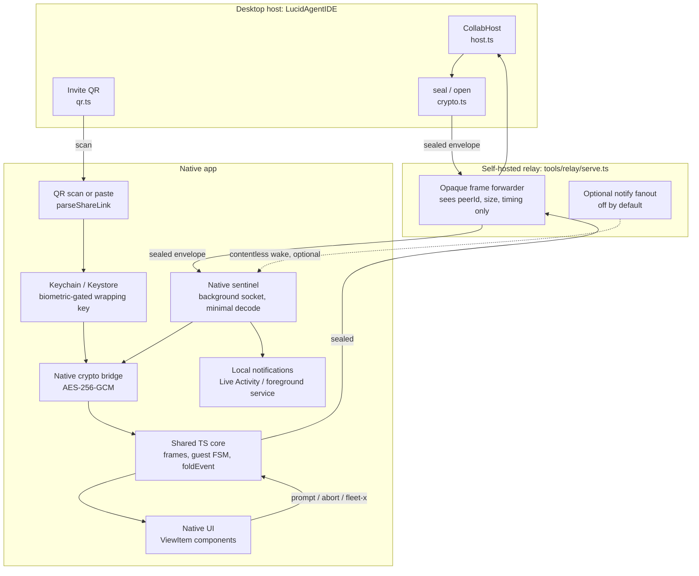

# Native mobile apps for LucidAgentIDE (iOS and Android)

Planning document. No code has been written for this. It specifies what to build, in
what order, and which forks were already decided so the implementer does not relitigate
them.

Audience: the maintainer and the product owner. Everything below assumes the
**edge-first mandate**: every capability must work against a self-hosted relay on a
private network with zero reachability to any vendor cloud. Cloud pieces (the Firebase
identity gate, Cloud Run hosting, APNs, FCM) are strictly optional enhancements. A
design that *requires* a vendor cloud to function is rejected on sight.

---

## 1. Purpose and scope

### Purpose

Replace the phone-shaped half of LucidAgentIDE's remote experience with real native
clients. Today that role is filled by `tools/remote-pwa/`, a browser app that joins a
collab room as a guest, renders the host's `ChatEvent` stream, and (for edit guests)
drives the host session. It works, and it is the correct proof that the protocol is
portable. It is also structurally incapable of the three things an operator actually
wants from a phone: know when a turn finished, know when the agent is blocked on an
approval, and be reachable while the screen is off.

The native apps exist to close exactly that gap. Everything else they inherit.

### In scope

- A native iOS app and a native Android app that join a LUCID collab room as guests,
  view-only or edit, over a self-hosted relay.
- Full parity with the current PWA feature set, phased (section 5).
- Background turn monitoring and notification delivery under the edge-first mandate
  (section 7), which is the entire reason this project exists.
- Hardware-backed secret storage, biometric gating, and an at-rest-encrypted transcript
  cache (section 8).
- A distribution path for defense and federal customers that does not assume a
  consumer app store install (section 10).

### Explicitly NOT in scope

- **The phone is never the agent runtime.** No tool execution, no file system access, no
  shell, no egress on behalf of the agent. Every action a phone initiates runs on the
  desktop host, through the host's existing fail-closed scan gate and exec/egress
  approvals. The phone is a remote control and an observer.
- **No model inference on device in v1.** Not a local small model, not a fallback
  summarizer, not on-device transcription. Push-to-talk audio is transcoded on device
  and transcribed by the host, exactly as the PWA does today.
- **No new authority.** The native client is not an enforcement point. A view-only guest
  cannot steer, and the reason it cannot steer is that the host refuses, not that the
  app hides a button.
- **No replacement of the desktop app.** Nothing here moves work off the desktop.
- **No offline agent operation.** If the host is unreachable, the app shows a cached
  transcript and nothing else. It never queues prompts for later delivery in v1, because
  a prompt that lands twenty minutes late against a changed workspace is a correctness
  hazard, not a feature.
- **The PWA is not deleted.** It remains the zero-install path for a laptop, a borrowed
  phone, or a platform we do not ship a binary for. The native apps and the PWA share
  the same protocol core, so keeping both costs one render layer, not two clients.

---

## 2. Why native

Each row is a concrete failure of the current PWA, and the specific platform capability
that fixes it. These are the justification for the whole project. If a row turns out to
be solvable in a browser, that row should be cut from the native scope.

| PWA limitation | Consequence today | Native capability that fixes it |
| --- | --- | --- |
| WebSockets are killed when the tab is backgrounded on both iOS and Android | A long agent turn silently disconnects the moment the user switches apps or locks the phone. The operator returns to a dead socket and a partial transcript. | Android: a foreground service with a `dataSync` type holds the socket indefinitely. iOS: a background `URLSession` wake channel plus a Live Activity, within the honest limits of section 7. |
| No push notifications | A turn finishing, or the agent blocking on an approval, cannot reach the user. The phone is useless unless it is already open and unlocked. | `UNUserNotificationCenter` and Android `NotificationManager` local notifications, fired by the native sentinel that owns the socket. No cloud required. |
| No biometric gate on the join secret | The room key sits in browser storage. Anyone holding an unlocked phone has an edit-capable session. | iOS Keychain with a `.biometryCurrentSet` access control, Android Keystore with `setUserAuthenticationRequired(true)`. The key is unwrappable only after a live biometric or device-credential check. |
| iOS PWA install is friction, and Safari evicts storage | The install flow is a share-sheet incantation most users never find, and WebKit's 7-day eviction policy for non-installed sites can silently drop the saved profile. | A real app icon from a real install, and an OS-managed sandbox that is not subject to eviction heuristics. |
| No share-sheet target | To send a screenshot or a link to the agent, the operator saves it, opens the PWA, and attaches it. Three steps too many. | iOS Share Extension and Android `ACTION_SEND` intent filter. A screenshot goes straight into a prompt from any app. |
| No background audio session for push-to-talk | Recording stops when anything else grabs audio focus, and a partially captured clip is transcoded and sent as if complete. | `AVAudioSession` with an explicit record category and interruption handling on iOS, `AudioManager` focus callbacks on Android. Interrupted clips are discarded, not silently truncated. |
| No haptics, no lock-screen surface, no OS integration | The phone has no way to signal urgency. An approval request looks identical to a token delta. | Haptic feedback on approval, a Live Activity or foreground-service notification showing elapsed turn time, an Android quick-settings tile, a Siri shortcut. |

Two of these (background sockets, notifications) are load-bearing. The rest are quality
of life. If the background and notification work fails its Phase 0 spike on iOS, the
project should be re-scoped to Android-only rather than shipping an iOS app that is a
worse PWA.

---

## 3. Technology decision

### The constraint that decides it

The wire protocol is a live, additive, discriminated union. `desktop/collab/frames.ts`
is 163 lines and grew four new guest frame types (`fleet-prompt`, `fleet-stop`,
`fleet-answer`, `interject`) in a single recent session, all while
`COLLAB_PROTOCOL_VERSION` stayed at 1 because the additive rule holds. Around it sit
`link.ts` (every join-link form), `crypto.ts` (the exact envelope), `guest.ts` (the
protocol state machine plus the `GuestView` view model), `relay_client.ts` (socket
lifecycle, fatal close codes, backoff, keepalive), and `pwa_view.ts` (`foldEvent`, the
pure reducer from `ChatEvent` to `ViewItem[]`). That is roughly 1,400 lines of pure,
DOM-free, already-tested TypeScript that fully describes what it means to be a LUCID
guest.

The question is not "which UI framework is nicest." It is **how many independent
implementations of that 1,400 lines the single maintainer is willing to keep in
lockstep**. Today the answer is one. Every option below is scored primarily on whether
it keeps the answer at one.

### Options

**(a) Two fully native codebases: Swift/SwiftUI and Kotlin/Compose**

Best possible platform integration, zero framework risk, zero App Store review risk,
and the smallest binaries. It takes the count from one implementation to three. Every
new frame type lands in TypeScript, then Swift, then Kotlin, and a missed port is a
silent behavioral divergence rather than a compile error, because the additive rule
means an unknown frame is *supposed* to be ignored. The failure mode is exactly the one
the protocol design makes invisible. Rejected for a single maintainer.

**(b) Kotlin Multiplatform with native UI layers**

Takes the count to two: TypeScript for the desktop and PWA, Kotlin for both mobile
clients, with SwiftUI and Compose on top. Genuinely good architecture and the right
answer for a team with an iOS engineer and an Android engineer. For one maintainer it
means owning Swift, Kotlin, Gradle, Xcode, and Kotlin/Native's Objective-C interop, and
hand-porting `foldEvent`, the guest state machine, and the envelope format into Kotlin
with a parity test suite that has to be written twice. Strong runner-up, not the pick.

**(c) React Native**

The pure TypeScript core runs as-is. `frames.ts`, `link.ts`, `guest.ts`, the
`relay_client.ts` state machine, and `foldEvent` are imported directly from the repo as
a shared workspace package. The count stays at **one**. Only the render layer is
rewritten, and that is the correct thing to rewrite: `renderItem` emits HTML strings
against a hand-written mobile stylesheet, which has no business on a native surface
anyway. Every native capability in section 2 is reachable through a native module, and
Hermes is an ahead-of-time bytecode interpreter with no JIT, which keeps iOS's W^X
posture clean and gives a defensible answer to a hardening reviewer.

**(d) Flutter**

Excellent rendering, mature tooling, good single-maintainer ergonomics *in isolation*.
Adds Dart as a third language to a repo whose stated invariant is TypeScript on Bun with
one Python sidecar, and takes the implementation count to two with no reuse of the
existing tested core. It buys pixel consistency, which is not a problem this product has.
Rejected.

**(e) Capacitor wrapping the existing PWA**

Superficially maximal reuse, and the WebView gives real WebCrypto for free. It collapses
under the only two requirements that matter. `WKWebView` is suspended when the app is
backgrounded, so the background socket has to move into native code regardless. Once the
socket is native, the sealed frames must be opened natively to decide whether to notify,
so the crypto moves native too. What remains in the WebView is a render layer, at which
point you are shipping a thin web wrapper with no native scroll, no native list
recycling, and a real App Store 4.2 minimum-functionality argument to lose. Rejected.

### Decision

> **Build with React Native, using a bare workflow (Expo prebuild for the config
> plumbing, no managed runtime, no over-the-air updates), consuming the existing pure
> TypeScript collab core unchanged as a shared workspace package.**

Concretely:

- **Shared, unchanged, imported from the repo:** `desktop/collab/frames.ts`,
  `link.ts`, `guest.ts`, `pwa_view.ts` (the `foldEvent` / `ViewItem` /
  `buildTurnReport` / `statusLabel` / `presentedStatus` half), and the
  `relay_client.ts` reconnect and close-code state machine. Extracted into a workspace
  package in Phase 0 so the desktop, the PWA, and the apps all consume one copy.
- **Discarded from the shared core:** `renderItem`, `renderTranscript`,
  `renderLaneCard`, `renderProcessRow`, `renderControls`, `renderReportHtml`. These
  produce HTML strings. They are replaced by React Native components that consume the
  same `ViewItem` union. The `escapeHtml` boundary disappears entirely, which removes an
  injection surface rather than porting it.
- **Native modules, written per platform:** AES-256-GCM `seal`/`open` bridge, Keychain
  and Keystore access, biometric prompt, the background socket sentinel, notification
  scheduling, Live Activity and foreground service, share extension, quick-settings
  tile, Siri shortcut, haptics, and TLS pin validation.
- **Hard rule: no over-the-air JavaScript updates.** No Expo Update, no CodePush. The
  bundle that ships is the bundle that was reviewed, signed, and hashed. This is
  non-negotiable for defense change control and it also removes the App Store 4.7
  conversation permanently.

**Why this wins:** it is the only option that keeps the protocol at one implementation
while giving unrestricted access to every native capability in section 2. The native
surface it *does* require is bounded and shallow: the background sentinel needs to
unpack a 4-byte peer id, AES-GCM open a payload, and inspect a JSON `t` field and event
kind. It does not need the reducer, the view model, or the UI. That is roughly 150 lines
per platform, not 1,400.

**Runner-up and its trigger condition:** Kotlin Multiplatform with native UI wins
instead **if the background sentinel's scope grows to require full protocol
comprehension while the JS engine is suspended.** Specific triggers, any one of which
should force a re-decision:

1. Background needs lane-level approval routing or per-lane state, not just a
   turn-complete and approval-pending signal, so the native sentinel has to reimplement
   `foldEvent` anyway.
2. A watchOS or Wear OS companion enters scope. Neither can practically host a JS engine,
   so the core has to exist in a native language regardless.
3. A customer's hardening baseline forbids an embedded script interpreter in the binary.
   Hermes is AOT and JIT-free, which is a defensible answer, but a hard prohibition is a
   hard prohibition.
4. The maintainer count reaches two or more with dedicated platform engineers, at which
   point option (a) also becomes viable and the reuse argument weakens.

If none of those become true within Phase 3, the decision stands permanently.

---

## 4. Architecture

### Joining a room

The invite link is `<roomId>.<base64url(key [|| writeToken])>`, and in every browser form
the secret rides the **URL fragment** so it never reaches a server or a proxy log
(`desktop/collab/link.ts`). The relay endpoint is a separate piece of deploy config and
is never carried in the browser link. Three join paths, in priority order:

1. **QR scan (primary).** The desktop already renders the invite as a QR via
   `desktop/collab/qr.ts`, a dependency-free byte-mode encoder. The app opens the camera,
   decodes, and parses with the shared `parseShareLink`. Requires zero infrastructure and
   works fully air-gapped. This is the path the product should optimize.
2. **Manual paste.** For a link delivered over a side channel. Same parser, same
   fail-closed behavior on a malformed or wrong-size link.
3. **Saved profile.** A named profile holds the relay endpoint, an optional display
   label, the pinned server SPKI set, and (optionally) the room secret itself. The secret
   is only ever unwrapped behind a live biometric check. Reconnecting to yesterday's
   session is a tap plus a face scan, not a rescan.

**Deep links are deliberately excluded from v1.** A custom URL scheme such as
`lucid://join#<secret>` is registrable by any other app on the device, and since the
secret lives in the fragment, a hijacking app receives the room key. That is a complete
compromise of the session for a convenience feature. Universal Links and Android App
Links are domain-bound and therefore safe, but they require serving
`.well-known/apple-app-site-association` and `.well-known/assetlinks.json` from the
deployment's own domain, and iOS resolves associated domains from the entitlement at
build time. The self-hosted relay already serves HTTP routes (`/healthz`, and a `GET /`
invite fallback), so it is the natural host for those files. This becomes viable in v2
for managed fleets via the iOS **managed associated domains** MDM payload, which injects
domains at runtime without a custom build. Until then: QR and paste only.

### Where the room key lives

- **iOS:** Keychain, `kSecAttrAccessibleWhenUnlockedThisDeviceOnly` (no iCloud Keychain
  sync, no backup restore onto another device), with a `SecAccessControl` of
  `.biometryCurrentSet` so re-enrolling a fingerprint or face invalidates the item.
- **Android:** Keystore, StrongBox-backed where the hardware offers it, with
  `setUserAuthenticationRequired(true)` and
  `setInvalidatedByBiometricEnrollment(true)`.

In both cases the Keystore item is a **wrapping key**, not the room key itself. The room
key is stored as an AES-GCM ciphertext in app storage and unwrapped on demand. This
keeps the hardware-backed item small and fixed-size, and it means rotating a room means
deleting a blob rather than touching the secure element.

**iOS gotcha to handle in Phase 1:** Keychain items survive app uninstall. On first run
the app must check a `UserDefaults` flag (which does not survive uninstall) and, if
absent, purge every Keychain item in its access group before doing anything else.
Otherwise a reinstalled app silently inherits the previous install's room keys.

### Sealing and opening frames on device

The envelope is unchanged from `desktop/collab/crypto.ts`, byte for byte:

```
[4 bytes big-endian peerId][12 bytes random IV][AES-256-GCM ciphertext || tag]
```

Peer 0 means broadcast from the host. Two code paths open it:

- **Foreground path (JavaScript).** The shared TS core runs in Hermes and calls into the
  native crypto bridge for `seal` and `open`. The bridge is CryptoKit `AES.GCM` on iOS
  and `javax.crypto` AES/GCM/NoPadding on Android. Using the native bridge rather than a
  JS WebCrypto polyfill is provisional; see open question 3. The interop contract is a
  fixed test-vector suite shared with `desktop/collab/crypto.test.ts`, so a bridge that
  drifts fails a test rather than a session.
- **Background path (native sentinel).** When the JS engine is suspended, the native
  sentinel owns the socket. It unpacks the envelope, opens the payload, parses the JSON,
  and inspects only `t` and, for `t === "event"`, the event kind. It decides whether to
  fire a local notification, buffers the sealed bytes (still sealed, in encrypted app
  storage), and hands the buffer to JS on the next foreground. **The sentinel never
  renders and never folds.** It answers one question: does the human need to look at
  their phone.

### Protocol version negotiation

`COLLAB_PROTOCOL_VERSION` stays 1 and the additive rule carries over unchanged. The
native client sends `hello { protocol: 1, name, writeToken? }` and refuses a mismatch by
surfacing the host's `error` frame, never by guessing a shape. On the receive side it
follows the same rule the PWA follows: **an unrecognized frame type is dropped, silently
and safely.** A dropped frame means an action does not happen, which is fail-closed, and
never means an unauthorized action happens.

The one addition the native client makes is a **capability line in the `hello` name
field is explicitly not used for this.** If mobile ever needs to advertise capabilities
(for example, "this client can render Live Activities"), that is a new optional field on
`HelloFrame`, additive, version stays 1. It is not a version bump and it is not encoded
into an existing string field.

### Diagram



The relay is on the wire but never in the trust boundary. It forwards ciphertext it
cannot read in either direction.

---

## 5. Feature parity matrix

Every capability the PWA has today. An "x" in Never means the native client deliberately
does not implement it, with the reason in the note.

| PWA capability | v1 | v2 | Never | Note |
| --- | :-: | :-: | :-: | --- |
| Join as view-only guest | x | | | The Phase 1 shippable core. |
| Join as edit guest (write token) | | x | | Requires the full write path and the host re-validation story to be exercised. |
| Live transcript: tokens, thinking, tool chips, subagents, blocks | x | | | `foldEvent` reused verbatim; only the renderers are native. |
| Replayed prior transcript on join (`welcome`) | x | | | Comes free with the shared guest state machine. |
| Reconnect grace masking (`RECONNECT_GRACE_MS`, 7s) | x | | | `presentedStatus` reused; matters more on mobile radios than on desktop. |
| Fatal close-code handling (4001/4004/4009/4029/4401/4403/4429) | x | | | Reused from the `relay_client.ts` state machine. Must also be mirrored in the native sentinel. |
| Text prompt composer | | x | | Write path, Phase 2. |
| Abort / stop turn | | x | | Write path, Phase 2. |
| Image attachments on a prompt | | x | | Native photo picker replaces the file input; host re-validates type, size, and count regardless. |
| Push-to-talk, transcoded to 16k mono WAV | | x | | Needs a proper `AVAudioSession` / audio-focus lifecycle so an interrupted clip is discarded, not truncated. |
| Model picker (edit guests) | | x | | Driven by the `options` frame; trivial once write lands. |
| Workspace / folder picker (edit guests) | | x | | Opaque folder ids only. No path ever crosses the wire. |
| Queue versus push composer split while streaming | | x | | Ships with the write path; it is part of what makes write usable mid-turn. |
| Check-in button | | x | | Ships with the write path. |
| Interject (mid-turn operator note) | | x | | Edit-gated; the host delivers it outside untrusted-content delimiters. |
| Fleet strip: lane list, name filter | | x | | Phase 4. `fleet-lanes` is a replace-in-place fold item, so it is cheap to render. |
| Per-lane prompt / stop / approve | | x | | Phase 4, and the primary driver of the lane-needs-approval notification. |
| Processes strip | | x | | Phase 4, replace-in-place like the fleet strip. |
| Preview snapshots from host to phone | | x | | Phase 4. Snapshots are already capped at a 1280px longest edge. |
| Markup strokes on a snapshot, sent back as an image prompt | | x | | Normalized 0..1 stroke space is already device-independent; a native canvas is a straight port. |
| End-of-run report: files changed, tools used, context fill | | x | | `buildTurnReport` is pure and reused; only `renderReportHtml` is replaced. |
| Report as copyable Markdown | | x | | `reportMarkdown` reused verbatim, wired to the native share sheet. |
| WebRTC P2P upgrade via `signal` frames | | x | | Phase 4 at the earliest. Real value on a LAN, but it needs a mobile ICE story and NAT testing. Do not ship it half-working. |
| Reconnect via encrypted Drive relay-codes file, optional PIN | | | x | Google Drive is a vendor cloud, which violates the mandate as a first-class path. The saved-profile plus QR rescan flow covers the same need offline. Revisit only if a customer asks and can reach Drive. |
| Firebase sign-in for an identity-gated relay | | x | | Optional by definition. Implemented as a pluggable token provider so an air-gapped build can omit the SDK entirely. |
| Entitlement / subscribe detection on close code 4403 | | x | | Only meaningful for the hosted relay; ships alongside the Firebase gate. |
| Install to home screen, web app manifest | | | x | Superseded by being an actual app. |
| Service worker static shell cache | | | x | Superseded by the app bundle. The transcript cache (section 6) is the real offline story. |
| Self-contained CSS mobile stylesheet | | | x | Replaced by native components. This is the single largest deliberate rewrite. |

---

## 6. Native-only features worth building

These do not exist in the PWA and cannot. They are the payoff.

- **Background turn monitoring.** A native sentinel owns the socket while the app is not
  foreground. On Android this is a typed foreground service and it works indefinitely and
  entirely offline. On iOS it works within the limits honestly stated in section 7. This
  is feature zero; everything else in this list depends on it.
- **Local notifications**, three classes, each with its own channel and importance:
  - *Turn complete.* Fired on the `done` event. Default importance.
  - *Approval requested.* Fired when the host signals a pending approval. High importance,
    time-sensitive, bypasses focus modes where the user has granted it.
  - *Lane needs approval.* Carries the lane label so an operator running a fleet knows
    which lane is stalled without opening the app. High importance.
- **Biometric unlock.** Face or fingerprint gates the room key unwrap, not just the app
  launch. A stolen unlocked phone still cannot mint an edit session.
- **Share-sheet ingest.** iOS Share Extension and Android `ACTION_SEND`. A screenshot, an
  image, a URL, or selected text goes straight into a prompt composer prefilled and ready
  to send. This routes through the ordinary `prompt` frame and therefore the host's
  ordinary scan gate; it is a shortcut into the existing path, never a new path.
- **Live Activity (iOS) and ongoing foreground-service notification (Android)** showing
  the running turn: lane or session label, elapsed time, and the current tool. On iOS
  this occupies the Dynamic Island and Lock Screen. Note the honest caveat: an iOS Live
  Activity only updates while the app has execution or via an APNs push, so on an
  air-gapped iPhone it shows a correct start time and a locally-ticking elapsed counter
  but cannot reflect state changes that arrive while the app is suspended.
- **Haptics on approval requests.** A distinct haptic pattern for approval-requested,
  separate from turn-complete. The point is that an operator can distinguish "done" from
  "blocked" without looking.
- **Siri shortcut and Android quick-settings tile.** "Ask LUCID for status" returns a
  spoken or glanceable summary: is a turn running, how long, how many lanes are blocked.
  The tile is the Android equivalent and is a one-swipe check from any screen.
- **Offline transcript cache.** The last N turns per room, encrypted at rest, readable
  with no network. Serves the commute case and the air-gap case equally. Read-only by
  design: no queued prompts (see scope exclusions).

---

## 7. Notification transport under the edge-first mandate

This is the hardest constraint in the document and the one most likely to be wished away.
It will not be wished away here.

**The fundamental fact:** APNs and FCM are vendor clouds. A remote push notification to
an iOS device *must* traverse Apple's infrastructure. There is no API, entitlement, or
enterprise program that lets a self-hosted server deliver a push directly to an iPhone.
Android is more forgiving, but FCM is equally a Google service. An air-gapped deployment
gets no remote push on either platform, full stop.

Everything below is about what remains once that is accepted.

### Option A: local notifications fired by an app that is still executing

The app schedules and fires notifications itself. No server involved, works fully
offline. The entire question is *how long the app keeps executing after the user leaves
it.*

- **Android: excellent.** A foreground service with `foregroundServiceType="dataSync"`
  keeps the process and the WebSocket alive indefinitely, with a persistent notification
  the user can see. Android 14 and later require the type declaration and a user-visible
  notification, both of which we want anyway. Caveats worth budgeting for: aggressive OEM
  battery managers (Xiaomi, Huawei, Oppo, OnePlus) kill background processes regardless of
  the documented contract, so the app needs a battery-optimization-exemption prompt and a
  clearly worded explanation. For an MDM-managed fleet the exemption can be pushed as
  policy, which removes the problem entirely.
- **iOS: poor.** `beginBackgroundTask` buys roughly thirty seconds after backgrounding.
  `BGAppRefreshTask` and `BGProcessingTask` are opportunistic, scheduled at the system's
  discretion, and routinely deliver minutes to hours late. Neither is a turn-complete
  alert.
- **iOS background modes that grant continuous execution are all traps here.** `audio`
  requires actually playing or recording audio and using it to keep a socket alive is a
  rejection. `voip` without CallKit reporting is both a rejection and an iOS 13+
  termination. `location` requires a plausible location purpose we do not have. The
  PushToTalk framework (iOS 16+) does grant background socket privileges, but it requires
  the `com.apple.developer.push-to-talk` entitlement and it delivers over APNs, so it is
  not offline. **Do not attempt any of these.**

### Option B: a self-hosted push relay over a persistent connection

Keep a socket to our own relay open while backgrounded and fire a local notification when
something arrives.

- **Android:** this is just Option A. The foreground service already holds the socket. No
  additional mechanism needed. This is the recommended Android design.
- **iOS:** not possible with a WebSocket, because the process is suspended. There is,
  however, one legitimate and underused lever: **a background `URLSession`**
  (`URLSessionConfiguration.background`). iOS relaunches a suspended or terminated app in
  the background when a background transfer completes. So the app can issue a **long-poll
  HTTP request against the self-hosted relay**, and when the relay responds (because
  something happened in the room), iOS wakes the app, which then fires a local
  notification and immediately re-arms the next long poll.

  This is cloud-free, App Store legal, and uses no forbidden background mode. It is also
  system-discretionary: iOS throttles apps that wake frequently, latency is not bounded,
  Low Power Mode suppresses it, and behavior overnight differs from behavior during
  active use. **It is a best-effort channel, not a guaranteed one, and the product must
  never claim otherwise.** Phase 0 must measure it before Phase 3 depends on it.

  It requires one relay change: a long-poll notify endpoint alongside the existing
  `/healthz` and `GET /` routes. The endpoint must remain zero-knowledge, which is
  discussed under Option C.

### Option C: APNs and FCM as an optional enhancement

For internet-connected deployments, real push is available and should be offered, off by
default.

The design constraint is that enabling push must not break the relay's zero-knowledge
property. Two sub-problems:

1. **Who decides a push is warranted?** The relay cannot tell a `done` frame from a token
   delta, because frames are opaque. Having the relay push on any traffic is useless
   noise. Therefore the **host** emits a small out-of-band notify hint to the relay when
   it knows something notification-worthy happened. The relay fans a **contentless wake**
   out to registered device tokens. The app wakes and pulls actual state over the sealed
   channel.
2. **What does this leak?** The hint tells the relay that an event of a coarse class
   ("turn complete", "approval pending") occurred in room X at time T. That is genuinely
   more than the relay knows today, which is only that bytes of some size moved. It is a
   **real regression in the threat model** and must be presented as such: an explicit,
   per-deployment opt-in with the leak spelled out in the settings copy, defaulting to off.
   The push payload itself carries no content, no room key, no text, nothing but a wake.

### Option D: what an air-gapped deployment realistically gets

Stated plainly, because this is what a defense customer will actually operate:

| Platform | App foreground | App backgrounded, screen on | Screen off / overnight |
| --- | --- | --- | --- |
| **Android** | Full: live transcript, instant local notifications, haptics. | Full: foreground service holds the socket, notifications fire in real time. | Full, subject to an OEM battery-manager exemption. This is a solved problem. |
| **iOS** | Full: live transcript, instant local notifications, haptics, Live Activity with live updates. | About 30 seconds of grace, then suspended. Live Activity keeps ticking elapsed time but stops reflecting new state. | Best-effort only: background `URLSession` long-poll wakes, unbounded latency, throttled and suppressed in Low Power Mode. Assume minutes, not seconds, and assume some wakes never arrive. |

**The honest summary:** Android gets true offline background monitoring. iOS does not, and
no amount of engineering changes that, because it is an OS policy decision by Apple.
On an air-gapped iPhone the app is a very good foreground console with a lock-screen
elapsed-time display and an unreliable background nudge. The product should say so in the
onboarding copy rather than let an operator discover it during an incident.

If reliable iOS alerting is a hard customer requirement, the only real answers are
(1) allow the deployment to reach APNs specifically, through a narrowly-scoped egress
allowance, or (2) accept Android as the operational phone platform. Both are business
decisions, not engineering ones.

---

## 8. Security model

### Threat boundaries

| Adversary | Can do | Cannot do |
| --- | --- | --- |
| Relay operator | See room ids, 4-byte peer ids, envelope sizes, message timing, source IPs, and (when the optional gate is on) Firebase identities. Deny service. | Read or forge any frame. It holds no room key, and the key is never transmitted to it. |
| Passive network observer | Same as above, minus anything TLS hides. | Read frames, even with the relay compromised. |
| Device thief, phone locked | Nothing. | Unwrap the room key. The Keystore item requires a live biometric or device credential. |
| Device thief, phone unlocked and app open | Read the visible transcript. | Persist beyond the session if the app re-prompts on foreground after a timeout, which it must. |
| Malicious or compromised guest | Send any guest frame it is entitled to send. | Exceed its access level. The host re-validates every guest action; a view guest's write is refused with an `error` frame. |
| Hostile content echoed into the transcript | Attempt prompt injection against the operator's reading of it. | Execute. Native components render text as text. There is no HTML boundary in the native client at all, which is strictly safer than the PWA's `escapeHtml` discipline. |
| Supply chain (npm, Gradle, CocoaPods) | Introduce code into the binary. | Bypass review of a locked, hash-pinned bundle, provided the no-OTA-updates rule holds. |

### What the relay can and cannot see

Unchanged from the desktop and PWA, and this must stay true. The relay forwards
`[4B peerId][12B IV][ciphertext || tag]` and logs rooms and peer counts only. It never
sees frame types, prompt text, answers, model names, folder names, images, or audio.
The single new exposure this project could introduce is the optional notify hint of
section 7 Option C, which is why it is off by default.

### Screenshot and preview snapshot handling on device

- **Android:** set `FLAG_SECURE` on any window showing transcript content or a preview
  snapshot. This blocks screenshots and screen recording, and blanks the app in the
  recents thumbnail. Make it a user-visible setting, default on for edit sessions.
- **iOS:** there is **no** equivalent. iOS cannot prevent a screenshot. What it can do:
  overlay a blur on `willResignActive` so the app-switcher snapshot is not readable,
  observe `UIScreen.isCaptured` and blank sensitive views while a recording or AirPlay
  mirror is active, and detect `userDidTakeScreenshot` to log the event to the session
  audit trail. State the limitation in the docs. For customers who need real enforcement,
  the answer is an MDM restriction that disables screenshots device-wide, which most
  defense baselines already apply.
- **Preview snapshots** are already downscaled to a 1280px longest edge before broadcast.
  On device they are held in memory and written to the encrypted cache only if the user
  has enabled transcript caching. They are never written to the shared photo library and
  never to a world-readable temporary directory.

### At-rest encryption of the cached transcript

App-layer AES-256-GCM over each cached record, using a data encryption key wrapped by the
Keychain or Keystore item. Deliberately *not* SQLCipher: an app-layer scheme over the
platform's own crypto avoids shipping a third-party crypto library, which keeps the
export-control and FIPS conversation simple and the dependency surface small. Records are
keyed by room and turn, and the cache is bounded and evicted oldest-first.

Cache is **off by default.** An operator who wants transcript history on their phone opts
in per profile, and the setting is one of the things an MDM App Config can force off.

### Certificate pinning for self-hosted relays

A self-hosted relay may use a private CA or a self-signed certificate, so pinning to a
public chain is not possible. The stance:

- **Trust on first use, with an explicit fingerprint confirmation.** The first connection
  to a new relay endpoint shows the server SPKI fingerprint and requires the user to
  accept it. The accepted pin set is stored with the profile.
- **Any subsequent mismatch is a hard failure with no bypass.** No "continue anyway"
  button. Changing a relay certificate is a deliberate act that requires re-confirming
  the profile.
- **MDM overrides TOFU entirely.** If a managed App Config supplies an SPKI pin list, the
  app uses it and disables the TOFU flow. A managed device never asks the user to make a
  trust decision.
- Pinning is on SPKI, not on the leaf certificate, so a routine renewal with the same key
  does not break the fleet.

### Session revocation and remote wipe

The room key only exists on the device, so revocation is fundamentally a host-side act.
The layers:

1. **Host ends the room.** The relay tears it down, guests receive `bye`, and the app
   clears the in-memory session. A new session means a new room and a new key, so the old
   secret is worthless.
2. **Profile purge on a revoked reason.** A `bye` carrying a revocation reason clears the
   saved profile and its wrapped key, not just the live session.
3. **MDM killswitch.** A managed App Config key that, when set, causes the app to purge
   every profile, every cached transcript, and every Keychain or Keystore item on next
   launch and refuse to join. This is the closest thing to remote wipe that does not
   require a cloud channel, and it is the mechanism a real fleet operator would use.
4. **MDM app removal** wipes the sandbox. Combined with the iOS first-run Keychain purge
   described in section 4, nothing survives.

### Fail-closed invariants carried into the native client

These are the invariants the desktop already enforces. The native client must not become
the place they weaken.

- **The client is not the enforcement point.** Hiding the composer for a view guest is
  UX. The guarantee is that `guest.ts` refuses to send and the host refuses to act. Both
  checks stay. A UI bug must not be able to produce an authorized write.
- **Every new native affordance funnels into an existing frame.** Share-sheet ingest, the
  Siri shortcut, and the quick-settings tile all produce ordinary `prompt`, `fleet-prompt`,
  or read-only queries. None of them introduces a new frame type that skips host
  validation. If a native feature seems to need a new privileged frame, that is a design
  error, not a protocol gap.
- **Unknown frames are dropped, never guessed.** The additive rule means a dropped frame
  is an action that does not happen. That is the safe direction.
- **Prompts run on the host.** They pass the host's scan gate and exec/egress approvals
  exactly like a locally typed prompt. The phone gains no privilege by being the origin.
- **No file paths cross the wire.** Workspace selection is by opaque host-minted id,
  resolved to a path locally on the host. The native workspace picker shows basenames and
  sends ids, same as the PWA.
- **Interject content is operator-marked.** The host delivers it outside untrusted-content
  delimiters and clearly labeled as operator origin. The native client must not
  pre-format or wrap it in a way that changes that.

---

## 9. Phased delivery plan

Effort bands are for one experienced engineer, calendar-agnostic, and assume no parallel
platform work. Each phase states its edge-first posture explicitly, because a phase that
quietly introduces a cloud dependency is the failure mode this plan exists to prevent.

### Phase 0: Foundations and the two spikes that can kill the project

**Scope**

- Extract the pure collab core into a workspace package consumed by the desktop, the PWA,
  and the apps. No behavior change, no protocol change; the PWA must still pass its
  existing tests against the extracted package.
- Stand up the React Native project, bare workflow, both platforms, no OTA updates
  configured anywhere.
- Write the native AES-GCM bridge on both platforms and prove interop against the
  existing `crypto.ts` test vectors.
- **Spike 1 (iOS background):** instrument a background `URLSession` long-poll against a
  self-hosted relay on a physical device. Measure wake latency across a full duty cycle
  including overnight and Low Power Mode.
- **Spike 2 (Android background):** a `dataSync` foreground service holding a WebSocket
  through a screen-off overnight period on at least one Pixel-class and one aggressive-OEM
  device.
- Decide the TOFU pinning UX and write it down.

**Exit criteria**

- The extracted core is imported by the PWA build and by the RN app, and the existing
  collab test suite passes unchanged.
- A native `seal` on iOS opens with the TypeScript `open`, and the reverse, and the same
  for Android, verified by a checked-in vector suite.
- A written spike report with a measured iOS wake-latency distribution over at least 72
  hours, and a pass or fail verdict on Android overnight socket survival per device.
- A dev build installs on a physical device on each platform from local signing.

**Edge-first posture:** total. Nothing in Phase 0 touches a vendor cloud. The spikes run
against `bun run tools/relay/serve.ts` on a LAN.

**Effort: 2 to 3 engineer-weeks.**

### Phase 1: Shippable minimum

The bar is a real app someone would use daily, not a scaffold.

**Scope**

- Join a room by QR scan or paste. Parse with the shared `parseShareLink`.
- Store the room secret behind a biometric-gated Keystore wrapping key, including the iOS
  first-run Keychain purge.
- TOFU certificate pinning with explicit fingerprint confirmation and no bypass on
  mismatch.
- Connect as a **view-only guest**, run the shared guest state machine, and render the
  live transcript natively from `foldEvent`: tokens, thinking blocks, tool chips with
  diffstats, subagent cards, and blocks.
- Replayed prior transcript from `welcome`.
- Reconnect with the existing backoff and the 7-second grace window, and correct handling
  of every fatal close code.
- Saved profiles, listed and rejoinable.
- No write path, no background sentinel, no notifications.

**Exit criteria**

- On both platforms, against a self-hosted relay with the device's internet access
  disabled: scan a QR, join, watch a complete multi-tool agent turn end to end, and see
  the same content the PWA shows for the same turn.
- Killing the host mid-turn and restarting it within the grace window produces no visible
  disconnection.
- Backgrounding and returning restores the transcript, correctly, with an honest
  "reconnected, may have missed events" state rather than a silently truncated log.
- A certificate change on the relay produces a hard, unbypassable failure.
- Both builds pass an internal-track install (TestFlight internal, Play internal testing).

**Edge-first posture:** total. No cloud code path exists in the binary yet. The Firebase
SDK is not linked.

**Effort: 5 to 7 engineer-weeks.**

### Phase 2: Write path and input

**Scope**

- Edit guest: write token handling, `prompt`, `abort`.
- Model picker and workspace picker driven by the `options` frame.
- Image attachments through the native photo picker and camera.
- Push-to-talk with a proper audio session lifecycle: interruption handling, focus loss,
  and discarding an incomplete clip rather than sending a truncated one.
- Queue versus push composer split while a turn is streaming.
- Check-in button and `interject`.
- Share-sheet ingest on both platforms, routed into the ordinary prompt composer.

**Exit criteria**

- An edit guest on a phone can drive a full turn on the desktop host, including switching
  model and workspace, and every action is visibly re-validated host-side.
- A view-only guest's attempt to write is refused by the client *and*, when the client
  check is bypassed in a test build, refused again by the host with an `error` frame.
  Both refusals must be demonstrated.
- A push-to-talk clip interrupted by an incoming call is discarded, and the user is told.
- Sharing a screenshot from another app lands in a prefilled prompt.

**Edge-first posture:** total. Audio is transcribed by the host, which is where
transcription already happens. Nothing new leaves the deployment.

**Effort: 4 to 6 engineer-weeks.**

### Phase 3: Background monitoring and notifications

The reason the project exists. Do not start it before Phase 0's spikes have verdicts.

**Scope**

- The native sentinel: a background socket owner with minimal envelope decode, on both
  platforms.
- Android: typed foreground service, ongoing notification with elapsed turn time, and a
  battery-optimization exemption flow.
- iOS: background `URLSession` long-poll wake channel, plus a Live Activity showing the
  running turn on the Lock Screen and Dynamic Island.
- Relay: an optional long-poll notify endpoint. Additive, off unless configured, and it
  learns nothing it does not already learn from forwarding traffic.
- Local notifications for turn-complete, approval-requested, and lane-needs-approval, on
  separate channels with appropriate importance.
- Haptics, distinct patterns per class.
- Android quick-settings tile and iOS Siri shortcut for a status glance.
- Optional and default-off: APNs and FCM contentless wake, with the metadata-leak
  disclosure in the settings copy.

**Exit criteria**

- Android, air-gapped, screen off for eight hours: a turn completing produces a
  notification within seconds, on both a Pixel-class and an aggressive-OEM device with the
  exemption granted.
- iOS, air-gapped, screen off: measured wake latency reported honestly in the app's own
  onboarding copy, matched by observed behavior. The app must never imply guaranteed
  delivery.
- Turning the optional cloud push off removes all APNs and FCM traffic, verified by packet
  capture, and the app remains fully functional.
- An approval-requested notification is haptically and visually distinguishable from
  turn-complete without opening the app.

**Edge-first posture:** the core is offline-only by construction and the cloud path is a
separate, default-off, disclosed enhancement. If the optional push code cannot be cleanly
excluded from an air-gap build variant, it does not ship.

**Effort: 5 to 8 engineer-weeks.**

### Phase 4: Fleet, preview, offline, and enterprise

**Scope**

- Fleet strip: lane list, name filter, per-lane prompt, stop, and approve, wired to
  `fleet-prompt`, `fleet-stop`, and `fleet-answer`.
- Processes strip.
- Preview snapshot viewer with pinch-zoom, plus markup strokes in normalized coordinates
  sent back as an image prompt.
- End-of-run report as native cards, and Markdown export through the native share sheet.
- Encrypted offline transcript cache, off by default, bounded and evicted oldest-first.
- MDM App Config surface: SPKI pin set, relay endpoint allowlist, force-disable transcript
  cache, force-enable Android `FLAG_SECURE`, and the wipe killswitch.
- iOS managed associated domains for Universal Link joining on managed fleets.
- Firebase identity gate as an optional, excludable module for hosted deployments, with
  the 4403 unentitled path.
- WebRTC P2P upgrade, only if LAN NAT testing supports it. This is the one item that may
  be cut without harming the release.

**Exit criteria**

- An operator running a multi-lane fleet can, from a locked phone, be notified that lane
  N needs approval, unlock biometrically, and approve it, without opening the desktop.
- An MDM-pushed App Config with a pin set makes the app skip TOFU entirely, verified on a
  supervised device.
- The killswitch config purges all profiles, caches, and Keystore items on next launch.
- An air-gap build variant compiles with the Firebase module excluded and passes the full
  Phase 1 through Phase 3 exit criteria.

**Edge-first posture:** every item works offline. The Firebase gate and Universal Links
are the only cloud-adjacent pieces, and both are optional modules absent from the air-gap
variant.

**Effort: 6 to 9 engineer-weeks.**

### Total

Roughly 22 to 33 engineer-weeks to full parity plus the native-only feature set, with a
genuinely shippable view-only client at the end of Phase 1 (7 to 10 weeks in) and the
core value proposition delivered at the end of Phase 3.

---

## 10. Build, signing, and distribution

### Apple

- **Apple Developer Program membership is mandatory** and is a new cost. The desktop build
  currently ships ad-hoc-signed with no Apple account at all (see
  `docs/MACOS-ENTERPRISE-DEPLOYMENT.md`). There is no equivalent escape hatch on iOS:
  every install path beyond a 7-day free provisioning profile requires a paid membership.
  Budget the annual fee and the enrollment lead time.
- **Distribution paths, in order of relevance:**
  - *TestFlight internal testing* for the maintainer and the product owner. Up to 100
    internal testers, no review for internal builds, fastest loop. This is the Phase 0
    through Phase 3 development channel.
  - *TestFlight external testing* for design partners. Requires a review pass per build
    train.
  - *Apple Business Manager Custom Apps* for defense and federal customers. The app is
    distributed privately to named organizations by their Organization ID or DUNS, never
    listed publicly, and redeemed through the customer's MDM. It still passes App Review,
    but privately, and it is the realistic enterprise path for an organization of this
    size.
  - *Ad Hoc* (100 UDID-registered devices per year) for a pilot where the customer will
    not stand up ABM.
  - *Apple Developer Enterprise Program* in-house distribution, hosted from an internal
    `itms-services` manifest, is the only path that installs without touching the App
    Store at all. It requires 100+ employees and Apple's discretionary approval. Assume it
    is unavailable unless the customer already holds a membership. See open question 2.
- **Air-gap reality on iOS:** an MDM-pushed App Store or Custom App install still fetches
  the binary from Apple's content servers at install time. A truly air-gapped iOS fleet
  therefore needs the enterprise in-house path, which most organizations do not have.
  **This must be resolved with the customer before Phase 1 ships**, because it can make
  iOS undeliverable for that customer regardless of how good the app is.

### Google

- **Play Console** is a one-time 25 USD registration. Materially cheaper and materially
  less restrictive.
- **Distribution paths:**
  - *Internal testing track*, up to 100 testers, minutes to propagate. Development channel.
  - *Managed Google Play private app*, published to a specific enterprise, invisible
    publicly.
  - *Direct AAB or APK sideload through an EMM* (Intune, Ivanti, Workspace ONE). This
    requires **no Google account, no Play Store, and no internet**. It is the air-gap
    answer and it works today.
- **Signing:** Play App Signing for the public track. For the EMM sideload path, sign with
  a locally held upload key so the customer's air-gapped install does not depend on
  Google's signing service. Both can coexist; the air-gap variant is a separate signing
  config.
- Android is the platform that satisfies the edge-first mandate end to end, including
  distribution. Say so to customers rather than pretending parity.

### MDM and enterprise configuration

Ship an App Config schema on both platforms (iOS Managed App Configuration, Android
`RestrictionsManager`) exposing at minimum:

| Key | Effect |
| --- | --- |
| `relayAllowlist` | The only relay endpoints the app may connect to. Anything else is refused. |
| `relayPinSet` | SPKI pins. When present, TOFU is disabled entirely. |
| `transcriptCacheAllowed` | Force-disables the encrypted offline cache. |
| `screenCaptureBlocked` | Forces Android `FLAG_SECURE` and the iOS blur and capture-detection behaviors. |
| `wipeOnNextLaunch` | Purges all profiles, caches, and Keystore items and refuses to join. |
| `identityGateRequired` | Requires the optional identity gate; refuses anonymous relays. |

On iOS, add the **managed associated domains** payload so a customer's own relay domain
can serve `.well-known/apple-app-site-association` and enable Universal Link joining
without a custom build.

### CI shape

Mirror `.github/workflows/build-desktop.yml`, which already builds and attaches artifacts
on `v*` tags with a `workflow_dispatch` escape hatch. Add `build-mobile.yml`:

- **iOS job** on `macos-latest`: `xcodebuild archive` plus `exportArchive`. Secrets: an
  App Store Connect API key (key id, issuer id, and the `.p8`), the distribution
  certificate as a base64 `.p12`, and the provisioning profile as base64.
- **Android job** on `ubuntu-latest`: `gradle bundleRelease` plus `assembleRelease` for
  the sideload variant. Secrets: the keystore as base64 plus its passwords.
- **Both:** produce an **air-gap variant** alongside the standard one, built with the
  optional cloud modules excluded, and verify the exclusion in CI by failing the build if
  the Firebase or push symbols appear in the air-gap binary.
- **Reproducibility:** pin the React Native version and every native dependency exactly,
  and publish the JavaScript bundle's SHA-256 in the release notes so a customer can
  verify that the binary they received contains the bundle that was published.
- **Enforced in CI:** fail the build if any OTA update configuration is present. The rule
  from section 3 is worth a lint, not just a convention.

---

## 11. Open questions

Each with the specific evidence needed to close it. Do not start the phase that depends on
a question until that question has an answer.

1. **What is the real iOS background `URLSession` wake latency under a production duty
   cycle?**
   *Evidence:* Phase 0 Spike 1. A minimum 72-hour instrumented run on a physical device,
   logging relay event timestamps against app wake timestamps, covering active use,
   overnight idle, and Low Power Mode. If the p50 exceeds a few minutes or the delivery
   rate falls below roughly 80 percent, Phase 3's iOS scope must be honestly reduced to a
   Live Activity plus foreground alerts, and the onboarding copy rewritten.
   *Blocks:* Phase 3.

2. **Does the target defense or federal customer hold Apple Business Manager, or an Apple
   Developer Enterprise Program membership?**
   *Evidence:* a direct answer from the customer's MDM administrator. This determines
   whether an air-gapped iOS install is possible at all, and it can make iOS
   undeliverable for that customer.
   *Blocks:* Phase 1 release planning, and possibly the decision to build iOS.

3. **Native AES-GCM bridge, or a JavaScript WebCrypto shim, for the foreground path?**
   *Evidence:* benchmark `seal` and `open` on a mid-tier device (a 4-year-old Android and
   an iPhone SE class) for the two realistic worst cases: a 200KB image prompt and a
   1280px preview snapshot. If the JS path stays under about 50ms, skip the bridge for
   foreground and keep it only for the sentinel, which halves the native crypto surface.
   *Blocks:* Phase 0 exit.

4. **Is FIPS 140-3 validated cryptography a contract requirement?**
   *Evidence:* the literal text of the customer's ATO or STIG requirement. This changes
   the crypto choice fundamentally. CryptoKit is not itself FIPS validated (Apple's
   corecrypto module is, in specific configurations), and Android needs Conscrypt with a
   validated BoringCrypto build. If mandated, the native bridge must target the validated
   module and the JS shim option in question 3 disappears.
   *Blocks:* Phase 0 crypto bridge design.

5. **Is the coarse metadata leak from the optional notify hint acceptable, and to whom?**
   *Evidence:* a written decision from the security owner stating the acceptable set of
   relay-visible metadata. The hint reveals that an event of a named class occurred in a
   named room at a known time, which the relay does not learn today.
   *Blocks:* Phase 3's optional cloud push, not the offline core.

6. **Does the customer require screen-capture blocking, and does iOS's inability to
   prevent screenshots disqualify it?**
   *Evidence:* the customer's MDM baseline. Many defense baselines already disable
   screenshots device-wide, which solves it outside the app and makes the question moot.
   *Blocks:* Phase 4's `screenCaptureBlocked` config and the associated documentation.

7. **How fast is the frame union actually growing?**
   *Evidence:* count frame-type additions to `desktop/collab/frames.ts` per release over
   the next two quarters. Four new guest frames landed in one recent session. If growth
   sustains at more than roughly one type per release *and* the additions require
   background comprehension, the Kotlin Multiplatform runner-up gains ground.
   *Blocks:* nothing immediately; it is the trigger to revisit section 3.

8. **Is a watchOS or Wear OS companion in scope within a year?**
   *Evidence:* a product owner decision. This materially changes the technology choice,
   because neither watch platform can practically host a JS engine, which would force the
   core into a native language regardless.
   *Blocks:* the section 3 decision's durability.

9. **Is adding an HTTP long-poll notify endpoint to `tools/relay/serve.ts` acceptable?**
   *Evidence:* a design review against the relay's stated contract of forwarding only
   opaque frames. The endpoint would carry no session content, but it is a new surface on
   a component whose value is its smallness. The relay already serves `/healthz` and an
   invite-fallback route, so the precedent exists.
   *Blocks:* Phase 3's iOS wake channel.

10. **How many concurrent rooms does a real operator monitor?**
    *Evidence:* usage observation or a direct answer from the product owner. One room is a
    single foreground service and one Live Activity. Five rooms is a fundamentally
    different background architecture and a different notification information design.
    *Blocks:* Phase 3's sentinel design.

11. **Do we ship a single binary with a runtime air-gap toggle, or two build variants?**
    *Evidence:* whether any target customer will accept a binary that merely does not use
    its cloud code paths, versus requiring that the code be absent. Defense reviewers
    frequently require absence. Two variants is the safe assumption and is what section 10
    plans for, but confirming it early avoids reworking the CI.
    *Blocks:* Phase 0 project setup, because it shapes the module boundaries.

---

## 12. Appendix: read these files first

In this order. Together they are roughly 2,500 lines and they contain everything a mobile
implementer needs to know about being a LUCID guest.

| File | Lines | Why |
| --- | --: | --- |
| `desktop/collab/frames.ts` | 163 | The entire wire contract, plus the additive-versioning rule that governs every future change. Read the trailing comment block twice. |
| `desktop/collab/crypto.ts` | 88 | The exact envelope the native bridge must reproduce byte for byte, including the 4-byte big-endian peer id header. |
| `desktop/collab/link.ts` | 134 | Every join-link form the QR scanner and the paste box must parse, and why the secret lives in the fragment. |
| `desktop/collab/guest.ts` | 323 | The guest protocol state machine and `GuestView`, which is the app's view model as-is. |
| `desktop/collab/relay_client.ts` | 352 | Socket lifecycle, fatal close codes, jittered backoff, and keepalive. The native sentinel must match this behavior exactly. |
| `desktop/collab/pwa_view.ts` | 371 | `foldEvent` and the `ViewItem` union to reuse verbatim; the `render*` functions are precisely the part to discard. |
| `desktop/renderer/chat_events.ts` | 62 | The `ChatEvent` union that `foldEvent` consumes. Small, and the source of truth for what a turn can contain. |
| `tools/remote-pwa/app.ts` | 886 | The reference wiring: what a real client calls, in what order, and how it handles each callback. The closest thing to a spec for the app's controller layer. |
| `tools/remote-pwa/index.html` | 462 | The current mobile information architecture and interaction model. Port the structure, discard the CSS. |
| `tools/relay/serve.ts` | 124 | The self-host entry point and its full config surface. This is what an edge deployment actually runs. |
| `desktop/collab/relay_auth.ts` | 221 | The optional Firebase identity gate. Read it to understand exactly what must stay optional and excludable. |
| `desktop/collab/qr.ts` | 311 | The desktop-side QR encoder whose output the phone scans: byte mode, EC level M, versions 1 through 10. |
| `desktop/collab/preview_snapshot.ts` | 44 | Snapshot sizing math and the normalized 0..1 markup stroke space, both directly reusable. |
| `desktop/collab/remote_entitlement.ts` | 128 | The close-code 4403 unentitled path, for the hosted-relay case only. |
| `desktop/collab/host.ts` | 379 | Host-side re-validation of every guest action. Read this to internalize why the client is not the enforcement point. |
| `.github/workflows/build-desktop.yml` | 355 | The release CI shape to mirror: tag-triggered, matrixed by platform, artifacts attached to the release. |
| `docs/MACOS-ENTERPRISE-DEPLOYMENT.md` | 172 | The existing enterprise distribution posture and the project's current signing reality, which iOS will break. |
